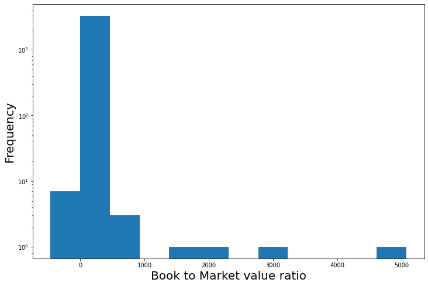
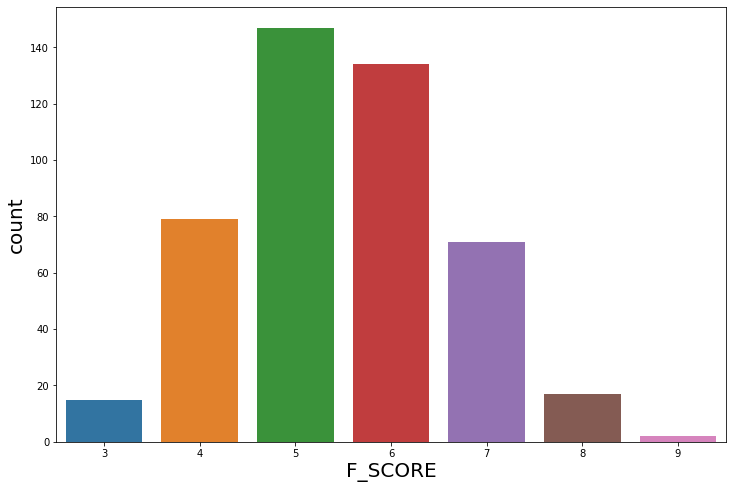

## Piotroski F-Score Trading Strategy

Piotroski's F-Score strategy is an algorithmic trading strategy based on a fundamental analysis of the historical financial statements made by a comapny's management. It is described in the paper by Joseph D. Piotroski titled *"Value Investing: The use of historical financial information to separate winners from losers"*.

Using this strategy we can select from a universe of all value firms (i.e. undervalued firms or firms with high ratio of book value to market value), the firms which have been incorrectly undervalued and have a strong potential to get the correct market valuation in the near future i.e. *winners* and the firms which are rightly valued low and are expected to go down i.e. *losers*. The final trading strategy will be to go long on the winners and short on the losers.

**Piotroski's F-Score** is a sum of 9 elements consiting of 3 types of measures viz. 4 profitability measures, 3 capital structure measures and 2 operational efficiency measures.

**Components of Piotroski's F-score**:

**I. Profitability measures**:
1. **ROA** : This component signifies the level of profitability of a firm. ROA or Return on Assets is measured as the net income before extraordinary items scaled by the beginning of the year total assets. The correspoding F-Score element, F_ROA = 1 if ROA > 0 and 0 otherwise.

2. **CFO** : This component signifies the level of cash flows of a firm. CFO or Cash Flow from Operations is caluclated as the total cash flow from operating activities (i.e. inflows and outflows from regular business activities obtained from the Cash Flow statement) scaled by the beginning of the year total assets. The correspnding F-Score element, F_CFO = 1 if CFO > 0 and 0 otherwise.

3. **$\Delta$ROA** : This component signifies the change in profitability of a firm. $\Delta$ROA is measured as the current year's ROA minus the previous year's ROA. The corresponding F-Score element, F_$\Delta$ROA = 1 if $\Delta$ROA >0 and 0 otherwise.

4. **Accrual** : Accrual is the part of revenue which the firm has not received in cash. Accrual is measured as ROA minus CFO i.e. the net income before extraordinary items minus cash flow from operations, the whole scaled by the beginning of the year total assets. The corresponding F-Score element F_ACCRUAL = 1 if Accrual < 0 and 0 otherwise.

**II. Capital Structure measures**:

5. **$\Delta$LEVER** : For distressed firms, increase in long-term debt is bad sign. Leverage is calculated as the total long term debt scaled by the average total asset. $\Delta$LEVER is euqal to the current year's leverage minus the previous year's leverage. The corresponsing F-Score element, F_$\Delta$LEVER = 1 if $\Delta$LEVER < 0 and 0 otherwise.

6. **$\Delta$LIQUID** : This component measures the short-term liquidity. Increase in short-term debt => decrease in current ratio/liquidity => bad for distressed firms. Current ratio is defined as the ratio of the firm's total current assets and current liabilities. $\Delta$LIQUID is measured as the current year's current ratio minus the previous year's current ratio. The corresponding, F-Score element, F_$\Delta$LIQUID = 1 if $\Delta$LIQUID > 0 and 0 otherwise.

7. **EQ_OFFER** : For distressed firms repeatedly raising money is not a good sign. EQ_OFFER = 1 if the firm didnot issue common equity in the year preceding the portfolio formation, 0 otherwise.

**III. Operating efficiency measures**:\
ROA = $\frac{\rm Profit}{\rm Total Assets}$ = $\frac{\rm Profit}{\rm Sales} \times \frac{\rm Sales}{\rm Total Assets}$ = $Margin \times Turnover$


8. **$\Delta$MARGIN** : \
GMO = Gross Margin Ratio = Gross Profit scaled by total Sales.\
$\Delta$MARGIN = current year's GMO - previous year's GMO. The corresponding F-Score element, F_$\Delta$MARGIN = 1 if $\Delta$MARGIN > 0, 0 otherwise.

9. **$\Delta$TURN** : \
ATR = Asset Turnover Ratio = Total Sales scaled by the beginning of the year total Assets\
$\Delta$TURN = Current year's ATR - previous year's ATR. The corresponding F-Score element, F_$\Delta$TURN = 1 if $\Delta$TURN > 0, 0 otherwise.

### Importing necessary modules


```python
import pandas as pd
from bs4 import BeautifulSoup
import bs4
import requests
from datetime import date
import plotly.express as px
import numpy as np
import seaborn as sns
import matplotlib.pyplot as plt
from format import format
```

### Getting the list of stocks from NASDAQ


```python
# getting a list of all the stocks from NASDAQ with Market Cap > 0

df = pd.read_csv('nasdaq_screener.csv')
df = df[df['Market Cap'] > 0]
df.reset_index(inplace=True, drop=True)
stocks = list(df['Symbol'])
len(stocks)
```


    5743


### Functions for web-scraping financial statement tables
Next, we will define some functions to scrape the marketwatch.com website to get the financial data of the firms required for calculating the F-Score elements, using the financial statements of the firms given on marketwatch.com


```python
# functions for web-scraping financial statement tables from marketwatch.com


def get_table_simple(table,is_table_tag=True):
    '''
    This function will use an html table element and will return 
    a list of lists representing the table
    
    inputs:
    table : an html element
    is_table_tag :  True or False (whether the table is an actual html table 
    element or a simple rows and columns separated by div elements.
    
    output : returns the table in a list of lists form
    '''
    elems = table.find_all('tr') if is_table_tag else get_children(table)
    table_data = list()
    for row in elems:
        row_data = list()
        row_elems = get_children(row)
        for elem in row_elems:
            text = elem.text.strip().replace("\n","")
            text = remove_multiple_spaces(text)
            if len(text)==0:
                continue
            row_data.append(text)
        table_data.append(row_data)
    return table_data

def get_children(html_content):
    return [item for item in html_content.children if type(item)==bs4.element.Tag or len(str(item).replace("\n","").strip())>0]

def remove_multiple_spaces(string):
    if type(string)==str:
        return ' '.join(string.split())
    return string


# function for reading balance sheet data from marketwatch.com using a stock ticker
def get_balance_sheet_data(ticker,yr):
    '''
    The function returns a dictionary of important financial measures for a particular year 
    obtained from the balance sheet of the firm with stock ticker 'ticker'
    
    inputs:
    ticker: stock ticker of the firm
    yr: The year in string notation (e.g. '2020')
    
    output:
    returns a dictionary of the important financial measures 
    (viz. total assets, total current assets, total liabilities, total current liabilities, 
    long-term debt and total common equity)
    '''
    
    urlbalancesheet = 'https://www.marketwatch.com/investing/stock/'+ticker+'/financials/balance-sheet'
    text_soup_balancesheet = BeautifulSoup(requests.get(urlbalancesheet).text,"lxml") #read in
    tables_balancesheet = text_soup_balancesheet.findAll('div', {'class': 'financials'})
    
    bs_assets_table = get_table_simple(tables_balancesheet[0],is_table_tag=True)
    bs_assets_table[0].remove('5-year trend')
    df_assets = pd.DataFrame.from_records(bs_assets_table[1:],columns=bs_assets_table[0])
    df_assets.rename(columns={'ItemItem':'Item'}, inplace=True)
    df_assets['Item'] = df_assets['Item'].astype(str).apply(lambda x: x[:len(x)//2])
    
    bs_liabilities_table = get_table_simple(tables_balancesheet[1],is_table_tag=True)
    bs_liabilities_table[0].remove('5-year trend')
    df_liabilities = pd.DataFrame.from_records(bs_liabilities_table[1:],columns=bs_liabilities_table[0])
    df_liabilities.rename(columns={'ItemItem':'Item'}, inplace=True)
    df_liabilities['Item'] = df_liabilities['Item'].astype(str).apply(lambda x: x[:len(x)//2])
    
    if yr not in df_assets.columns or yr not in df_liabilities.columns:
        return {'longTermDebt': None,'totalAssets': None, 'totalCurrentAssets': None, 'totalLiabilities': None, 'totalCurrentLiabilities': None, 'commonStock': None}

    totalassets = text_parse(df_assets[df_assets.Item=='Total Assets'][yr].values[0])
    totalcurrentassets = text_parse(df_assets[df_assets.Item=='Total Current Assets'][yr].values[0])
    
    longtermdebt = text_parse(df_liabilities[df_liabilities.Item == 'Long-Term Debt'][yr].values[0])
    totalliabilities = text_parse(df_liabilities[df_liabilities.Item == 'Total Liabilities'][yr].values[0])
    totalcurrentliabilities = text_parse(df_liabilities[df_liabilities.Item == 'Total Current Liabilities'][yr].values[0])
    commonequity = text_parse(df_liabilities[df_liabilities.Item == 'Common Equity (Total)'][yr].values[0])
    
    return {'longTermDebt':longtermdebt,'totalAssets':totalassets, 'totalCurrentAssets': totalcurrentassets, 'totalLiabilities':totalliabilities, 'totalCurrentLiabilities':totalcurrentliabilities, 'commonStock':commonequity}


# function for reading income statement data from marketwatch.com using a stock ticker
def get_income_statement_data(ticker,yr):  
    '''
    The function returns a dictionary of important financial measures for a particular year 
    obtained from the income statement of the firm with stock ticker 'ticker'
    
    inputs:
    ticker: stock ticker of the firm
    yr: The year in string notation (e.g. '2020')
    
    output:
    returns a dictionary of the important financial measures 
    (viz. Net Income, Gross Profit and Total Revenue)
    '''
    
    url_financials = 'https://www.marketwatch.com/investing/stock/'+ticker+'/financials'
    text_soup_financials = BeautifulSoup(requests.get(url_financials).text,"lxml") #read in
    tables_incomestatement = text_soup_financials.findAll('div', {'class': 'financials'})
    
    is_table = get_table_simple(tables_incomestatement[0],is_table_tag=True)
    is_table[0].remove('5-year trend')
    df_is = pd.DataFrame.from_records(is_table[1:],columns=is_table[0])
    df_is.rename(columns={'ItemItem':'Item'}, inplace=True)
    df_is['Item'] = df_is['Item'].astype(str).apply(lambda x: x[:len(x)//2])
    
    if yr not in df_is.columns:
        return {'netIncome': None,'grossProfit': None,'totalRevenue': None}
    
    netincome =text_parse(df_is[df_is['Item']=='Net Income'][yr].values[0])
    grossprofit = text_parse(df_is[df_is['Item']=='Gross Income'][yr].values[0])
    totalsales = text_parse(df_is[df_is['Item']=='Sales/Revenue'][yr].values[0])
    
    return {'netIncome': netincome,'grossProfit': grossprofit,'totalRevenue': totalsales}


# function for reading cash flow statement data from marketwatch.com using a stock ticker
def get_cash_flow_data(ticker,yr):  
    '''
    The function returns a dictionary of important financial measures for a particular year 
    obtained from the cash flow statement of the firm with stock ticker 'ticker'
    
    inputs:
    ticker: stock ticker of the firm
    yr: The year in string notation (e.g. '2020')
    
    output:
    returns a dictionary of the important financial measures 
    (viz. total cash from operating activities)
    '''
        
    urlcashflow = 'https://www.marketwatch.com/investing/stock/'+ticker+'/financials/cash-flow'
    text_soup_cashflow = BeautifulSoup(requests.get(urlcashflow).text,"lxml") #read in
    tables_cashflow = text_soup_cashflow.findAll('div', {'class': 'financials'})
    cf_table = get_table_simple(tables_cashflow[0],is_table_tag=True)
    
    cf_table[0].remove('5-year trend')
    df_cf = pd.DataFrame.from_records(cf_table[1:],columns=cf_table[0])
    df_cf.rename(columns={'ItemItem':'Item'}, inplace=True)
    df_cf['Item'] = df_cf['Item'].astype(str).apply(lambda x: x[:len(x)//2])
    
    if yr not in df_cf.columns:
        return {'totalCashFromOperatingActivities': None}

    cashflowoperating = text_parse(df_cf[df_cf['Item']=='Net Operating Cash Flow'][yr].values[0])
    
    return {'totalCashFromOperatingActivities': cashflowoperating}


def text_parse(text):
    '''
    This function to convert the string outputs of the 
    financial statements to float values  
    '''
    text = text.strip('(').strip(')').strip('$').strip(' ')
    if text == '-' or text == '':
        return 0    
    elif text[-1] == 'T':
        return float(text.strip('T'))*1e12
    elif text[-1] == 'B':
        return float(text.strip('B'))*1e9
    elif text[-1] == 'M':
        return float(text.strip('M'))*1e6
    elif text[-1] == 'K':
        return float(text.strip('K'))*1e3
    else:
        print(text)
        raise ValueError
        
```

### Getting the Book to Market Value ratios (BM) for all the stocks


```python
# getting the book values and market values, and their ratios for all the stocks in the list (wherever available) 
# for the previous year

Book_Value_list = []
Market_Cap_list= []
B2M_dict = dict()
i=0
for symbol in stocks:
    i+=1
    try:
        #print(symbol)
        Total_Assets_cur_year = get_balance_sheet_data(symbol,'2020')['totalAssets']
        Total_Liabilities_cur_year = get_balance_sheet_data(symbol,'2020')['totalLiabilities']
        Book_Value = Total_Assets_cur_year-Total_Liabilities_cur_year
        Book_Value_list.append(Book_Value)
        Market_Cap = df[df.Symbol==symbol]['Market Cap'].values[0]
        Market_Cap_list.append(Market_Cap)
        B2M = Book_Value/Market_Cap
        B2M_dict[symbol]=B2M
    except (IndexError, ValueError) as error:
        pass

    sorted_B2M_dict = {k: v for k, v in sorted(B2M_dict.items(), key=lambda item: item[1], reverse=True)}
```

    A
    AA
    AACG
    AACQ
    AAIC
    AAL
    AAMC
    AAME
    AAN
    AAOI
    AAON
    AAP
    AAPL
    AAT
    AAU
    AAWW
    AB
    ABB
    ABBV
    ABC
    ABCB
    ABCL
    ABCM
    ABEO
    ABEV
    ABG
    ABGI
    ABIO
    ABM
    ABMD
    ABNB
    ABR
    ABST
    ABT
    ABTX
    ABUS
    AC
    ACA
    ACAC
    ACAD
    ACB
    ACBI
    ACC
    ACCD
    ACCO
    ACEL
    ACER
    ACET
    ACEV
    ACGL
    ACH
    ACHC
    ACHV
    ACI
    ACIC
    ACIU
    ACIW
    ACLS
    ACM
    ACMR
    ACN
    ACNB
    ACND
    ACOR
    ACP
    ACR
    ACRE
    ACRS
    ACRX
    ACST
    ACTC
    ACTG
    ACU
    ACV
    ACY
    ADAG
    ADAP
    ADBE
    ADC
    ADCT
    ADES
    ADI
    ADIL
    ADM
    ADMA
    ADMP
    ADMS
    ADN
    ADNT
    ADOC
    ADP
    ADPT
    ADS
    ADSK
    ADT
    ADTN
    ADTX
    ADUS
    ADV
    ADVM
    ADX
    ADXN
    ADXS
    AE
    AEE
    AEF
    AEG
    AEGN
    AEHL
    AEHR
    AEI
    AEIS
    AEL
    AEM
    AEMD
    AENZ
    AEO
    AEP
    AER
    AERI
    AES
    AESE
    AEY
    AEYE
    AEZS
    AFB
    AFG
    AFGC
    AFI
    AFIB
    AFIN
    AFL
    AFMD
    AFRM
    AFT
    AFYA
    AG
    AGBA
    AGC
    AGCB
    AGCO
    AGD
    AGE
    AGEN
    AGFS
    AGFY
    AGI
    AGIO
    AGLE
    AGM
    AGMH
    AGNC
    AGO
    AGR
    AGRO
    AGRX
    AGS
    AGTC
    AGX
    AGYS
    AHAC
    AHC
    AHCO
    AHH
    AHPI
    AHT
    AI
    AIF
    AIG
    AIH
    AIHS
    AIKI
    AIM
    AIMC
    AIN
    AINC
    AINV
    AIO
    AIR
    AIRC
    AIRG
    AIRI
    AIRT
    AIT
    AIV
    AIZ
    AJAX
    AJG
    AJRD
    AJX
    AKAM
    AKBA
    AKER
    AKIC
    AKR
    AKRO
    AKTS
    AKTX
    AKU
    AKUS
    AL
    ALAC
    ALB
    ALBO
    ALC
    ALCO
    ALDX
    ALE
    ALEC
    ALEX
    ALG
    ALGM
    ALGN
    ALGS
    ALGT
    ALIM
    ALJJ
    ALK
    ALKS
    ALL
    ALLE
    ALLK
    ALLO
    ALLT
    ALLY
    ALNA
    ALNY
    ALOT
    ALPN
    ALRM
    ALRN
    ALRS
    ALSK
    ALSN
    ALT
    ALTA
    ALTG
    ALTM
    ALTO
    ALTR
    ALTU
    ALUS
    ALV
    ALVR
    ALX
    ALXN
    ALXO
    ALYA
    AM
    AMAL
    AMAT
    AMBA
    AMBC
    AMBO
    AMC
    AMCR
    AMCX
    AMD
    AME
    AMED
    AMEH
    AMG
    AMGN
    AMH
    AMHC
    AMK
    AMKR
    AMN
    AMNB
    AMOT
    AMOV
    AMP
    AMPE
    AMPG
    AMPH
    AMPY
    AMR
    AMRB
    AMRC
    AMRK
    AMRN
    AMRS
    AMRX
    AMS
    AMSC
    AMSF
    AMST
    AMSWA
    AMT
    AMTB
    AMTBB
    AMTI
    AMTX
    AMWD
    AMWL
    AMX
    AMYT
    AMZN
    AN
    ANAB
    ANAT
    ANCN
    ANDA
    ANDE
    ANET
    ANF
    ANGI
    ANGN
    ANGO
    ANH
    ANIK
    ANIP
    ANIX
    ANNX
    ANPC
    ANSS
    ANTE
    ANTM
    ANVS
    ANY
    AOD
    AON
    AONE
    AOS
    AOSL
    AOUT
    AP
    APA
    APAM
    APD
    APDN
    APEI
    APEN
    APG
    APH
    APHA
    API
    APLE
    APLS
    APLT
    APM
    APO
    APOG
    APOP
    APPF
    APPH
    APPN
    APPS
    APR
    APRE
    APRN
    APSG
    APT
    APTO
    APTS
    APTV
    APTX
    APVO
    APWC
    APXT
    APYX
    AQB
    AQMS
    AQN
    AQST
    AQUA
    AR
    ARAV
    ARAY
    ARBG
    ARC
    ARCB
    ARCC
    ARCE
    ARCH
    ARCO
    ARCT
    ARD
    ARDC
    ARDS
    ARDX
    ARE
    AREC
    ARES
    ARGO
    ARGX
    ARI
    ARKO
    ARKR
    ARL
    ARLO
    ARLP
    ARMK
    ARMP
    ARNA
    ARNC
    AROC
    AROW
    ARPO
    ARQT
    ARR
    ARRY
    ARTL
    ARTNA
    ARTW
    ARVN
    ARW
    ARWR
    ARYA
    ASA
    ASAN
    ASAQ
    ASB
    ASC
    ASG
    ASGI
    ASGN
    ASH
    ASIX
    ASLE
    ASLN
    ASM
    ASMB
    ASML
    ASND
    ASO
    ASPL
    ASPN
    ASPS
    ASPU
    ASR
    ASRT
    ASRV
    ASTC
    ASTE
    ASUR
    ASX
    ASYS
    AT
    ATAC
    ATAX
    ATC
    ATCO
    ATCX
    ATEC
    ATEN
    ATEX
    ATGE
    ATH
    ATHA
    ATHE
    868
    ATHM
    ATHX
    ATI
    ATIF
    ATKR
    ATLC
    ATLO
    ATNF
    ATNI
    ATNM
    ATNX
    ATO
    ATOM
    ATOS
    ATR
    ATRA
    ATRC
    ATRI
    ATRO
    ATRS
    ATSG
    ATTO
    ATUS
    ATVI
    ATXI
    AU
    AUB
    AUBN
    AUDC
    AUMN
    AUPH
    AUTL
    AUTO
    AUUD
    AUVI
    AUY
    AVA
    AVAL
    AVAN
    AVAV
    AVB
    AVCO
    AVCT
    AVD
    AVDL
    AVDR
    AVEO
    AVGO
    AVGR
    AVID
    AVIR
    AVK
    AVLR
    AVNS
    AVNT
    AVNW
    AVO
    AVRO
    AVT
    AVTR
    AVXL
    AVY
    AVYA
    AWF
    AWH
    AWI
    AWK
    AWP
    AWR
    AWRE
    AWX
    AX
    AXAS
    AXDX
    AXGN
    AXL
    AXLA
    AXNX
    AXON
    AXP
    AXR
    AXS
    AXSM
    AXTA
    AXTI
    AXU
    AY
    AYI
    AYLA
    AYRO
    AYTU
    AYX
    AZEK
    AZN
    AZO
    AZPN
    AZRE
    AZRX
    AZUL
    AZYO
    AZZ
    B
    BA
    BABA
    BAC
    BAF
    BAH
    BAK
    BALY
    BAM
    BANC
    BAND
    BANF
    BANR
    BANX
    BAOS
    BAP
    BASI
    BATL
    BATRA
    BATRK
    BAX
    BB
    BBAR
    BBBY
    BBCP
    BBD
    BBDC
    BBDO
    BBF
    BBGI
    BBI
    BBIG
    BBIO
    BBK
    BBL
    BBN
    BBQ
    BBSI
    BBU
    BBVA
    BBW
    BBY
    BC
    BCAB
    BCAC
    BCAT
    BCBP
    BCC
    BCDA
    BCE
    BCEI
    BCEL
    BCH
    BCLI
    BCML
    BCO
    BCOR
    BCOV
    BCOW
    BCPC
    BCRX
    BCS
    BCSF
    BCTG
    BCTX
    BCV
    BCX
    BCYC
    BDC
    BDJ
    BDL
    BDN
    BDR
    BDSI
    BDSX
    BDTX
    BDX
    BE
    BEAM
    BECN
    BEDU
    BEEM
    BEKE
    BELFA
    BELFB
    BEN
    BENE
    BEP
    BEPC
    BERY
    BEST
    BFAM
    BFC
    BFI
    BFIN
    BFK
    BFLY
    BFRA
    BFS
    BFST
    BFT
    BFY
    BFZ
    BG
    BGB
    BGCP
    BGFV
    BGH
    BGI
    BGIO
    BGNE
    BGR
    BGS
    BGSF
    BGT
    BGX
    BGY
    BH
    BHAT
    BHB
    BHC
    BHE
    BHF
    BHK
    BHLB
    BHP
    BHR
    BHSE
    BHTG
    BHV
    BHVN
    BIDU
    BIF
    BIG
    BIGC
    BIIB
    BILI
    BILL
    BIMI
    BIO
    BIOC
    BIOL
    BIOX
    BIP
    BIPC
    BIT
    BIVI
    BJ
    BJRI
    BK
    BKCC
    BKD
    BKE
    BKEP
    BKH
    BKI
    BKN
    BKNG
    BKR
    BKSC
    BKT
    BKTI
    BKU
    BKYI
    BL
    BLBD
    BLCM
    BLCT
    BLD
    BLDP
    BLDR
    BLE
    BLFS
    BLI
    BLIN
    BLK
    BLKB
    BLL
    BLMN
    BLNK
    BLPH
    BLRX
    BLSA
    BLTS
    BLU
    BLUE
    BLUW
    BLW
    BLX
    BMA
    BMBL
    BME
    BMEZ
    BMI
    BMO
    BMRA
    BMRC
    BMRN
    BMTC
    BMTX
    BMY
    BNED
    BNFT
    BNGO
    BNL
    BNR
    BNS
    BNSO
    BNTC
    BNTX
    BNY
    BOAC
    BOCH
    BOE
    BOH
    BOKF
    BOLT
    BOMN
    BOOM
    BOOT
    BORR
    BOSC
    BOTJ
    BOWX
    BOX
    BOXL
    BP
    BPFH
    BPMC
    BPMP
    BPOP
    BPRN
    BPT
    BPTH
    BPTS
    BPY
    BPYU
    BQ
    BR
    BRBR
    BRBS
    BRC
    BREZ
    BRFS
    BRG
    BRID
    BRKL
    BRKR
    BRKS
    BRLI
    BRMK
    BRN
    BRO
    BROG
    BRP
    BRPA
    BRQS
    BRT
    BRX
    BRY
    BSAC
    BSBK
    BSBR
    BSD
    BSE
    BSET
    BSGM
    BSIG
    BSL
    BSM
    BSMX
    BSPE
    BSQR
    BSRR
    BST
    BSTZ
    BSVN
    BSX
    BSY
    BTA
    BTAI
    BTAQ
    BTAQU
    BTBT
    BTG
    BTI
    BTN
    BTNB
    BTO
    BTRS
    BTT
    BTU
    BTWN
    BTZ
    BUD
    BUFF
    BUI
    BUR
    BURL
    BUSE
    BV
    BVH
    BVN
    BVS
    BVXV
    BW
    BWA
    BWAC
    BWAY
    BWB
    BWEN
    BWFG
    BWG
    BWMX
    BWXT
    BX
    BXC
    BXG
    BXMT
    BXMX
    BXP
    BXRX
    BXS
    BY
    BYD
    BYFC
    BYM
    BYND
    BYSI
    BZH
    BZM
    BZUN
    C
    CAAP
    CAAS
    CABA
    CABO
    CAC
    CACC
    CACI
    CADE
    CAE
    CAF
    CAG
    CAH
    CAI
    CAJ
    CAKE
    CAL
    CALA
    CALB
    CALM
    CALT
    CALX
    CAMP
    CAMT
    CAN
    CANF
    CANG
    CAP
    CAPA
    CAPL
    CAPR
    CAR
    CARA
    CARE
    CARG
    CARR
    CARS
    CARV
    CAS
    CASA
    CASH
    CASI
    CASS
    CASY
    CAT
    CATB
    CATC
    CATM
    CATO
    CATY
    CB
    CBAH
    CBAN
    CBAT
    CBAY
    CBB
    CBD
    CBFV
    CBH
    CBIO
    CBLI
    CBMB
    CBNK
    CBOE
    CBPO
    CBRE
    CBRL
    CBSH
    CBT
    CBTX
    CBU
    CBZ
    CC
    CCAC
    CCAP
    CCB
    CCBG
    CCCC
    CCD
    CCEP
    CCF
    CCI
    CCIV
    CCJ
    CCK
    CCL
    CCLP
    CCM
    CCMP
    CCNC
    CCNE
    CCO
    CCOI
    CCRC
    CCRN
    CCS
    CCU
    CCV
    CCX
    CCXI
    CD
    CDAK
    CDAY
    CDE
    CDEV
    CDK
    CDLX
    CDMO
    CDNA
    CDNS
    CDOR
    CDR
    CDTX
    CDW
    CDXC
    CDXS
    CDZI
    CE
    CEA
    CECE
    CEE
    CEI
    CEIX
    CELC
    CELH
    CELP
    CEM
    CEMI
    CEN
    CENT
    CENTA
    CENX
    CEO
    CEPU
    CEQP
    CERC
    CERE
    CERN
    CERS
    CERT
    CET
    CETX
    CEV
    CEVA
    CF
    CFAC
    CFB
    CFBK
    CFFI
    CFFN
    CFG
    CFII
    CFIV
    CFMS
    CFR
    CFRX
    CFX
    CG
    CGA
    CGBD
    CGC
    CGEM
    CGEN
    CGIX
    CGNT
    CGNX
    CGO
    CGRO
    CHAQ
    CHCI
    CHCO
    CHCT
    CHD
    CHDN
    CHE
    CHEF
    CHEK
    CHFS
    CHFW
    CHGG
    CHH
    CHI
    CHK
    CHKP
    CHMA
    CHMG
    CHMI
    CHN
    CHNG
    CHNR
    CHPM
    CHPT
    CHRA
    CHRS
    CHRW
    CHS
    CHT
    CHTR
    CHUY
    CHW
    CHWY
    CHX
    CHY
    CI
    CIA
    CIB
    CIDM
    CIEN
    CIF
    CIG
    CIGI
    CIH
    CII
    CIIC
    CIK
    CIM
    CINF
    CINR
    CIO
    CIR
    CIT
    CIVB
    CIX
    CIXX
    CIZN
    CJJD
    CKH
    CKPT
    CKX
    CL
    CLA
    CLAR
    CLB
    CLBK
    CLBS
    CLDB
    CLDR
    CLDT
    CLDX
    CLEU
    CLF
    CLFD
    CLGN
    CLGX
    CLH
    CLI
    CLII
    CLIR
    CLLS
    CLM
    CLMT
    CLNC
    CLNE
    CLNN
    CLNY
    CLOV
    CLPR
    CLPS
    CLPT
    CLR
    CLRB
    CLRO
    CLS
    CLSD
    CLSK
    CLSN
    CLVR
    CLVS
    CLVT
    CLW
    CLWT
    CLX
    CLXT
    CM
    CMA
    CMBM
    CMC
    CMCL
    CMCM
    CMCO
    CMCSA
    CMCT
    CMD
    CME
    CMG
    CMI
    CMLF
    CMLS
    CMO
    CMP
    CMPI
    CMPR
    CMPS
    CMRE
    CMRX
    CMS
    CMT
    CMTL
    CMU
    CNA
    CNBKA
    CNC
    CNCE
    CNDT
    CNET
    CNEY
    CNF
    CNFR
    CNHI
    CNI
    CNK
    CNMD
    CNNB
    CNNE
    CNO
    CNOB
    CNP
    CNQ
    CNR
    CNS
    CNSL
    CNSP
    CNST
    CNTG
    CNTY
    CNX
    CNXC
    CNXN
    CO
    COCP
    CODA
    CODI
    CODX
    COE
    COF
    COFS
    COG
    COGT
    COHN
    COHR
    COHU
    COKE
    COLB
    COLD
    COLL
    COLM
    COMM
    COMS
    CONE
    CONN
    COO
    COOL
    COOP
    COP
    COR
    CORE
    CORR
    CORT
    COST
    COTY
    COUP
    COWN
    CP
    CPA
    CPAC
    CPB
    CPE
    CPF
    CPG
    CPHC
    CPHI
    CPIX
    CPK
    CPLG
    CPLP
    CPRI
    CPRT
    CPRX
    CPS
    CPSH
    CPSI
    CPSR
    CPSS
    CPST
    CPT
    CPTA
    CQP
    CR
    CRAI
    CRBP
    CRC
    CRDF
    CREE
    CREG
    CRESY
    CREX
    CRF
    CRH
    CRHC
    CRHM
    CRI
    CRIS
    CRK
    CRKN
    CRL
    CRM
    CRMD
    CRMT
    CRNC
    CRNT
    CRNX
    CRON
    CROX
    CRS
    CRSA
    CRSP
    CRSR
    CRT
    CRTD
    CRTO
    CRTX
    CRU
    CRUS
    CRVL
    CRVS
    CRWD
    CRWS
    CRY
    CS
    CSBR
    CSCO
    CSCW
    CSGP
    CSGS
    CSII
    CSIQ
    CSL
    CSLT
    CSOD
    CSPI
    CSPR
    CSQ
    CSR
    CSSE
    CSTE
    CSTL
    CSTM
    CSTR
    CSU
    CSV
    CSWC
    CSWI
    CSX
    CTAC
    CTAQ
    CTAS
    CTB
    CTBI
    CTEK
    CTG
    CTHR
    CTIB
    CTIC
    CTK
    CTLT
    CTMX
    CTO
    CTR
    CTRE
    CTRM
    CTRN
    CTS
    CTSH
    CTSO
    CTT
    CTVA
    CTXR
    CTXS
    CUB
    CUBA
    CUBE
    CUBI
    CUE
    CUEN
    CUK
    CULP
    CURI
    CURO
    CUTR
    CUZ
    CVA
    CVAC
    CVBF
    CVCO
    CVCY
    CVE
    CVEO
    CVET
    CVGI
    CVGW
    CVI
    CVLG
    CVLT
    CVLY
    CVM
    CVNA
    CVR
    CVS
    CVU
    CVV
    CVX
    CW
    CWBC
    CWBR
    CWCO
    CWEN
    CWH
    CWK
    CWST
    CWT
    CX
    CXDC
    CXDO
    CXE
    CXH
    CXP
    CXW
    CYAD
    CYAN
    CYBE
    CYBR
    CYCC
    CYCN
    CYD
    CYH
    CYRN
    CYRX
    CYTH
    CYTK
    CZNC
    CZR
    CZWI
    CZZ
    D
    DAC
    DADA
    DAIO
    DAKT
    DAL
    DAN
    DAO
    DAR
    DARE
    DASH
    DAVA
    DB
    DBD
    DBDR
    DBI
    DBL
    DBTX
    DBVT
    DBX
    DCBO
    DCF
    DCI
    DCO
    DCOM
    DCP
    DCPH
    DCRB
    DCT
    DCTH
    DD
    DDD
    DDF
    DDMX
    DDOG
    DDS
    DE
    DEA
    DECK
    DEH
    DEI
    DELL
    DEN
    DENN
    DEO
    DESP
    DEX
    DFFN
    DFH
    DFHT
    DFIN
    DFNS
    DFP
    DFPH
    DFS
    DG
    DGICA
    DGICB
    DGII
    DGLY
    DGNR
    DGNS
    DGX
    DHC
    DHF
    DHI
    DHIL
    DHR
    DHT
    DHX
    DHY
    DIAX
    DIN
    DIOD
    DIS
    DISCA
    DISCB
    DISCK
    DISH
    DIT
    DJCO
    DK
    DKL
    DKNG
    DKS
    DL
    DLA
    DLB
    DLHC
    DLNG
    DLPN
    DLR
    DLTH
    DLTR
    DLX
    DM
    DMAC
    DMB
    DMF
    DMLP
    DMO
    DMRC
    DMS
    DMTK
    DMYD
    DMYI
    DNB
    DNK
    DNLI
    DNMR
    DNN
    DNOW
    DNP
    DOC
    DOCU
    DOGZ
    DOMO
    DOOO
    DOOR
    DORM
    DOV
    DOW
    DOX
    DOYU
    DPG
    DPW
    DPZ
    DQ
    DRD
    DRE
    DRH
    DRI
    DRIO
    DRNA
    DRQ
    DRRX
    DRTT
    DRVN
    DS
    DSAC
    DSE
    DSGX
    DSKE
    DSL
    DSM
    DSP
    DSPG
    DSS
    DSSI
    DSU
    DSWL
    DSX
    DT
    DTE
    DTEA
    DTF
    DTIL
    DTSS
    DUC
    DUK
    DUO
    DUOT
    DVA
    DVAX
    DVD
    DVN
    DWIN
    DWSN
    DX
    DXC
    DXCM
    DXF
    DXPE
    DXR
    DXYN
    DY
    DYAI
    DYN
    DYNT
    DZSI
    E
    EA
    EAC
    EAD
    EAF
    EAR
    EARN
    EARS
    EAST
    EAT
    EB
    EBAY
    EBC
    EBF
    EBIX
    EBMT
    EBON
    EBR
    EBS
    EBSB
    EBTC
    EC
    ECC           
    ECF
    ECHO
    ECL
    ECOL
    ECOM          
    ECOR
    ECPG
    ED
    EDAP
    EDD
    EDF
    EDI
    EDIT
    EDN
    EDRY
    EDSA
    EDTK
    EDTX
    EDTXU
    EDU
    EDUC
    EEA
    EEFT
    EEX
    EFC
    EFF
    EFL
    EFOI
    EFR
    EFSC
    EFT
    EFX
    EGAN
    EGBN
    EGF
    EGHT
    EGLE
    EGO
    EGOV
    EGP
    EGRX
    EGY
    EH
    EHC
    EHI
    EHT
    EHTH
    EIG
    EIGR
    EIM
    EIX
    EKSO
    EL
    ELA
    ELAN
    ELDN
    ELF
    ELLO
    ELMD
    ELOX
    ELP
    ELS
    ELSE
    ELTK
    ELVT
    ELY
    ELYS
    EMAN
    EMCF
    EMD
    EME
    EMF
    EMKR
    EML
    EMN
    EMO
    EMPW
    EMR
    EMX
    ENB
    ENBL
    ENDP
    ENG
    ENIA
    ENIC
    ENLC
    ENLV
    ENOB
    ENPC
    ENPH
    ENR
    ENS
    ENSG
    ENSV
    ENTA
    ENTG
    ENTX
    ENV
    ENVA
    ENVB
    ENX
    ENZ
    EOD
    EOG
    EOI
    EOLS
    EOS
    EOSE
    EOT
    EPAC
    EPAM
    EPAY
    EPC
    EPD
    EPHY
    EPIX
    EPM
    EPR
    EPRT
    EPSN
    EPZM
    EQ
    EQBK
    EQC
    EQD
    EQH
    EQIX
    EQNR
    EQOS
    EQR
    EQS
    EQT
    EQX
    ERC
    ERES
    ERF
    ERH
    ERIC
    ERIE
    ERII
    ERJ
    ERYP
    ES
    ESBK
    ESCA
    ESE
    ESEA
    ESGC
    ESGR
    ESI
    ESLT
    ESNT
    ESP
    ESPR
    ESQ
    ESRT
    ESS
    ESSA
    ESSC
    ESTA
    ESTC
    ESTE
    ESXB
    ET
    ETAC
    ETB
    ETG
    ETH
    ETJ
    ETM
    ETN
    ETNB
    ETO
    ETON
    ETR
    ETRN
    ETSY
    ETTX
    ETV
    ETW
    ETWO
    ETX           
    ETY
    EURN
    EVA
    EVAX
    EVBG
    EVBN
    EVC
    EVER
    EVF
    EVFM
    EVG
    EVGN
    EVH
    EVI
    EVK
    EVLO
    EVM
    EVN
    EVOK
    EVOL
    EVOP
    EVR
    EVRG
    EVRI
    EVT
    EVTC
    EVV
    EVY
    EW
    EWBC
    EXAS
    EXC
    EXD
    EXEL
    EXFO
    EXG
    EXK
    EXLS
    EXN
    EXP
    EXPC
    EXPD
    EXPE
    EXPI
    EXPO
    EXPR
    EXR
    EXTN
    EXTR
    EYE
    EYEG
    EYEN
    EYES
    EYPT
    EZGO
    EZPW
    F
    FAF
    FAII
    FAM
    FAMI
    FANG
    FANH
    FARM
    FARO
    FAST
    FAT
    FATE
    FAX
    FB
    FBC
    FBHS
    FBIO
    FBIZ
    FBK
    FBMS
    FBNC
    FBP
    FBRX
    FBSS
    FC
    FCAC
    FCAP
    FCBC
    FCBP
    FCCO
    FCCY
    FCEL
    FCF
    FCFS
    FCN
    FCNCA
    FCO
    FCPT
    FCRD
    FCT
    FCX
    FDBC
    FDEU
    FDMT
    FDP
    FDS
    FDUS
    FDX
    FE
    FEDU
    FEI           
    FEIM
    FELE
    FEN
    FENC
    FENG
    FEO
    FET
    FEYE
    FF
    FFA
    FFBC
    FFBW
    FFC
    FFG
    FFHL
    FFIC
    FFIN
    FFIV
    FFNW
    FFWM
    FGB
    FGBI
    FGEN
    FGF
    FGNA
    FHB
    FHI
    FHN
    FHTX
    FI
    FIBK
    FICO
    FIF
    FIII
    FINS
    FINV
    FIS
    FISI
    FISV
    FITB
    FIV
    FIVE
    FIVN
    FIX
    FIXX
    FIZZ
    FL
    FLAC
    FLC
    FLDM
    FLEX
    FLGT
    FLIC
    FLIR
    FLL
    FLMN
    FLNG
    FLNT
    FLO
    FLOW
    FLR
    FLS
    FLT
    FLUX
    FLWS
    FLXN
    FLXS
    FLY
    FMAC
    FMAO
    FMBH
    FMBI
    FMC
    FMN
    FMNB
    FMO
    FMS
    FMTX
    FMX
    FMY
    FN
    FNB
    FNCB
    FND
    FNF
    FNHC
    FNKO
    FNLC
    FNV
    FNWB
    FOCS
    FOE
    FOF
    FOLD
    FONR
    FOR
    FORD
    FORM
    FORR
    FORTY
    FOSL
    FOUR
    FOX
    FOXA
    FOXF
    FOXW
    FPAC
    FPAY
    FPF
    FPH
    FPI
    FPL
    FPRX
    FR
    FRA
    FRAF
    FRBA
    FRBK
    FRC
    FRD
    FREE
    FREQ
    FRG
    FRGI
    FRHC
    FRLN
    FRME
    FRO
    FROG
    FRPH
    FRPT
    FRSX
    FRT
    FRTA
    FRX
    FSBW
    FSD
    FSEA
    FSFG
    FSI
    FSII
    FSK
    FSKR
    FSLF
    FSLR
    FSLY
    FSM
    FSP
    FSR
    FSRV
    FSS
    FST
    FSTR
    FSTX
    FSV
    FT
    FTAI
    FTCH
    FTDR
    FTEK
    FTF
    FTFT
    FTHM
    FTI
    FTIV
    FTK
    FTNT
    FTOC
    FTS
    FTSI
    FTV
    FUBO
    FUL
    FULC
    FULT
    FUN
    FUNC
    FUND
    FURY
    FUSB
    FUSE
    FUSN
    FUTU
    FUV
    FVAM
    FVCB
    FVE
    FVRR
    FWAA
    FWONA
    FWONK
    FWP
    FWRD
    FXNC
    G
    GAB
    GABC
    GAIA
    GAIN
    GALT
    GAM
    GAN
    GASS
    GATO
    GATX
    GAU
    GB
    GBAB
    GBCI
    GBDC
    GBIO
    GBL
    GBLI
    GBNY
    GBOX
    GBR
    GBS
    GBT
    GBX
    GCBC
    GCI
    GCMG
    GCO
    GCP
    GCV
    GD
    GDDY
    GDEN
    GDL
    GDO
    GDOT
    GDP
    GDRX
    GDS
    GDV
    GDYN
    GE
    GECC
    GEF
    GEG
    GEL
    GEN           
    GENC
    GENE
    GEO
    GEOS
    GER
    GERN
    GES
    GEVO
    GF
    GFED
    GFF
    GFI
    GFL
    GFN
    GGAL
    GGB
    GGG
    GGM
    GGN
    GGO
    GGT
    GGZ
    GH
    GHC
    GHG
    GHL
    GHLD
    GHM
    GHSI
    GHVI
    GHY
    GIB
    GIFI
    GIGM
    GIII
    GIK
    GIL
    GILD
    GILT
    GIM
    GIS
    GIX
    GKOS
    GL
    GLAD
    GLBS
    GLBZ
    GLDD
    GLDG
    GLEO
    GLG
    GLMD
    GLNG
    GLO
    GLOB
    GLOG
    GLOP
    GLP
    GLPG
    GLPI
    GLQ
    GLRE
    GLSI
    GLT
    GLTO
    GLU
    GLUU
    GLV
    GLW
    GLYC
    GM
    GMAB
    GMBL
    GMDA
    GME
    GMED
    GMLP
    GMRE
    GMS
    GMTX
    GNCA
    GNE
    GNFT
    GNK
    GNL
    GNLN
    GNMK
    GNOG
    GNPX
    GNRC
    GNRS
    GNSS
    GNT
    GNTX
    GNTY
    GNUS
    GNW
    GO
    GOAC
    GOCO
    GOED
    GOEV
    GOF
    GOGL
    GOGO
    GOL
    GOLD
    GOLF
    GOOD
    GOOG
    GOOGL
    GOOS
    GORO
    GOSS
    GOVX
    GP
    GPC
    GPI
    GPK
    GPL
    GPM
    GPMT
    GPN
    GPP
    GPRE
    GPRK
    GPRO
    GPS
    GPX
    GRA
    GRAY
    GRBK
    GRC
    GRCL
    GRCY
    GRF
    GRFS
    GRIL
    GRIN
    GRMN
    GRNQ
    GRNV
    GROW
    GRPN
    GRSV
    GRTS
    GRTX
    GRUB
    GRVY
    GRWG
    GRX
    GS
    GSAH
    GSAT
    GSBC
    GSBD
    GSHD
    GSIT
    GSK
    GSKY
    GSL
    GSM
    GSMG
    GSS
    GSUM
    GSV
    GSX
    GT
    GTBP
    GTE
    GTEC
    GTES
    GTH
    GTHX
    GTIM
    GTIP
    GTLS
    GTN
    GTS
    GTT
    GTY
    GTYH
    GURE
    GUT
    GVA
    GVP
    GWAC
    GWB
    GWGH
    GWPH
    GWRE
    GWRS
    GWW
    GXGX
    GYRO
    H
    HA
    HAAC
    HAE
    HAFC
    HAIN
    HAL
    HALL
    HALO
    HAPP
    HARP
    HAS
    HASI
    HAYN
    HBAN
    HBB
    HBCP
    HBI
    HBIO
    HBM
    HBMD
    HBNC
    HBP
    HBT
    HCA
    HCAP
    HCAQ
    HCAT
    HCC
    HCCI
    HCDI
    HCHC
    HCI
    HCKT
    HCM
    HCSG
    HD
    HDB
    HDSN
    HE
    HEAR
    HEC
    HEES
    HEI
    HELE
    HEP
    HEPA
    HEQ
    HES
    HESM
    HEXO
    HFBL
    HFC
    HFFG
    HFRO
    HFWA
    HGBL
    HGEN
    HGLB
    HGSH
    HGV
    HHC
    HHR
    HI
    HIBB
    HIE
    HIFS
    HIG
    HIHO
    HII
    HIL
    HIMS
    HIMX
    HIO
    HIW
    HIX
    HJLI
    HKIB
    HL
    HLF
    HLG
    HLI
    HLIO
    HLIT
    HLNE
    HLT
    HLX
    HLXA
    HMC
    HMCO
    HMG
    HMHC
    HMLP
    HMN
    HMNF
    HMPT
    HMST
    HMSY
    HMTV
    HMY
    HNGR
    HNI
    HNNA
    HNP
    HNRG
    HNW
    HOFT
    HOFV
    HOG
    HOL
    HOLI
    HOLX
    HOMB
    HOME
    HON
    HONE
    HOOK
    HOPE
    HOTH
    HOV
    HP
    HPE
    HPF
    HPI
    HPK
    HPP
    HPQ
    HPR
    HPS
    HPX
    HQH
    HQI
    HQL
    HQY
    HR
    HRB
    HRC
    HRI
    HRL
    HRMY
    HROW
    HRTG
    HRTX
    HRZN
    HSAQ
    HSBC
    HSC
    HSDT
    HSIC
    HSII
    HSKA
    HSON
    HST
    HSTM
    HSTO
    HSY
    HT
    HTA
    HTBI
    HTBK
    HTBX
    HTD
    HTGC
    HTGM
    HTH
    HTHT
    HTLD
    HTLF
    HTOO
    HTPA
    HTY
    HUBB
    HUBG
    HUBS
    HUDI
    HUGE
    HUIZ
    HUM
    HUN
    HURC
    HURN
    HUSA
    HUSN
    HUYA
    HVBC
    HVT
    HWBK
    HWC
    HWCC
    HWKN
    HWM
    HX
    HXL
    HY
    HYB
    HYFM
    HYI
    HYLN
    HYMC
    HYRE
    HYT
    HZAC
    HZN
    HZNP
    HZO
    HZON
    IAA
    IAC
    IACA
    IAE
    IAF
    IAG
    IART
    IBA
    IBCP
    IBEX
    IBIO
    IBKR
    IBM
    IBN
    IBOC
    IBP
    IBTX
    ICAD
    ICBK
    ICCC
    ICCH
    ICD
    ICE
    ICFI
    ICHR
    ICL
    ICLK
    ICLR
    ICMB
    ICON
    ICPT
    ICUI
    ID
    IDA
    IDBA
    IDCC
    IDE
    IDEX
    IDN
    IDRA
    IDT
    IDXX
    IDYA
    IEA
    IEC
    IEP
    IESC
    IEX
    IFF
    IFMK
    IFN
    IFRX
    IFS
    IGA
    IGAC
    IGC
    IGD
    IGI
    IGIC
    IGLD
    IGMS
    IGR
    IGT
    IH
    IHC
    IHD
    IHG
    IHIT
    IHRT
    IHT
    IHTA
    IIAC
    IID
    IIF
    III
    IIIN
    IIIV
    IIM
    IIN
    IIPR
    IIVI
    IKNX
    IKT
    ILMN
    ILPT
    IMAB
    IMAC
    IMAX
    IMBI
    IMCC
    IMCR
    IMGN
    IMH
    IMKTA
    IMMP
    IMMR
    IMNM
    IMO
    IMOS
    IMPX
    IMRA
    IMRN
    IMTE
    IMTX
    IMUX
    IMV
    IMVT
    IMXI
    INBK
    INBX
    INCY
    INDB
    INDO
    INDT
    INFI
    INFN
    INFO
    INFU
    INFY
    ING
    INGN
    INGR
    INM
    INMB
    INMD
    INN
    INNV
    INO
    INOD
    INOV
    INPX
    INS
    INSE
    INSG
    INSI
    INSM
    INSP
    INSW
    INT
    INTC
    INTG
    INTT
    INTU
    INTZ
    INUV
    INVA
    INVE
    INVH
    INVO
    INZY
    IO
    IONS
    IOR
    IOSP
    IOVA
    IP
    IPA
    IPAR
    IPDN
    IPG
    IPGP
    IPHA
    IPHI
    IPI
    IPOD
    IPOE
    IPOF
    IPV
    IPWR
    IQ
    IQI
    IQV
    IR
    IRBT
    IRCP
    IRDM
    IRIX
    IRL
    IRM
    IRMD
    IROQ
    IRR
    IRS
    IRT
    IRTC
    IRWD
    ISBC
    ISD
    ISDR
    ISEE
    ISIG
    ISNS
    ISR
    ISRG
    ISSC
    ISTR
    ISUN
    IT
    ITAC
    ITCB
    ITCI
    ITGR
    ITI
    ITIC
    ITMR
    ITOS
    ITP
    ITRG
    ITRI
    ITRM
    ITRN
    ITT
    ITUB
    ITW
    IVA
    IVAC
    IVC
    IVH
    IVR
    IVZ
    IX
    IZEA
    J
    JACK
    JAGX
    JAKK
    JAMF
    JAN
    JAX
    JAZZ
    JBGS
    JBHT
    JBL
    JBLU
    JBSS
    JBT
    JCE
    JCI
    JCO
    JCOM
    JCS
    JCTCF
    JD
    JDD
    JE
    JEF
    JELD
    JEMD
    JEQ
    JFIN
    JFR
    JFU
    JG
    JGH
    JHAA
    JHB
    JHG
    JHI
    JHS
    JHX
    JIH
    JILL
    JJSF
    JKHY
    JKS
    JLL
    JLS
    JMIA
    JMM
    JMP
    JNCE
    JNJ
    JNPR
    JOB
    JOBS
    JOE
    JOF
    JOUT
    JP
    JPC
    JPI
    JPM
    JPS
    JPT
    JQC
    JRI
    JRJC
    JRO
    JRS
    JRSH
    JRVR
    JSD
    JT
    JTA
    JTD
    JUPW
    JVA
    JWN
    JWS
    JYAC
    JYNT
    K
    KAI
    KALA
    KALU
    KALV
    KAMN
    KAR
    KB
    KBAL
    KBH
    KBNT
    KBR
    KBSF
    KC
    KDMN
    KDNY
    KDP
    KE
    KELYA
    KELYB
    KEN
    KEP
    KEQU
    KERN
    KEX
    KEY
    KEYS
    KF
    KFFB
    KFRC
    KFS
    KFY
    KGC
    KHC
    KIDS
    KIM
    KIN
    KINS
    KINZ
    KIO
    KIQ
    KIRK
    KKR
    KL
    KLAC
    KLDO
    KLIC
    KLR
    KLXE
    KMB
    KMDA
    KMF
    KMI
    KMPH
    KMPR
    KMT
    KMX
    KN
    KNDI
    KNL
    KNOP
    KNSA
    KNSL
    KNTE
    KNX
    KO
    KOD
    KODK
    KOF
    KOP
    KOPN
    KOR
    KOS
    KOSS
    KPTI
    KR
    KRA
    KRBP
    KRC
    KREF
    KRG
    KRKR
    KRMD
    KRNT
    KRNY
    KRO
    KRON
    KROS
    KRP
    KRTX
    KRUS
    KRYS
    KSM
    KSMT
    KSPN
    KSS
    KSU
    KT
    KTB
    KTCC
    KTF
    KTOS
    KTRA
    KUKE
    KURA
    KVHI
    KW
    KWAC
    KWR
    KXIN
    KYMR
    KYN
    KZIA
    KZR
    L
    LABP
    LAC
    LACQ
    LAD
    LADR
    LAIX
    LAKE
    LAMR
    LANC
    LAND
    LANDM
    LARK
    LASR
    LATN
    LAUR
    LAWS
    LAZ
    LAZR
    LAZY
    LB
    LBAI
    LBC
    LBRDA
    LBRDK
    LBRT
    LBTYA
    LBTYB
    LBTYK
    LC
    LCAP
    LCI
    LCII
    LCNB
    LCTX
    LCUT
    LCY
    LDI
    LDL
    LDOS
    LDP
    LE
    LEA
    LEAF
    LEAP
    LECO
    LEDS
    LEE
    LEG
    LEGH
    LEGN
    LEJU
    LEN
    LEO
    LESL
    LEU
    LEVI
    LEVL
    LEXX
    LFC
    LFMD
    LFT
    LFTR
    LFUS
    LFVN
    LGHL
    LGI
    LGIH
    LGL
    LGND
    LGVN
    LH
    LHCG
    LHDX
    LHX
    LI
    LIFE
    LII
    LILA
    LILAK
    LIN
    LINC
    LIND
    LINX
    LIQT
    LITB
    LITE
    LIVE
    LIVK
    LIVN
    LIVX
    LIXT
    LIZI
    LJPC
    LKCO
    LKFN
    LKQ
    LL
    LLIT
    LLNW
    LLY
    LMAT
    LMB
    LMFA
    LMND
    LMNL
    LMNR
    LMNX
    LMPX
    LMRK
    LMST
    LMT
    LNC
    LND
    LNDC
    LNG
    LNN
    LNSR
    LNT
    LNTH
    LOAC
    LOAN
    LOB
    LOCO
    LODE
    LOGC
    LOGI
    LOKB
    LOMA
    LOOP
    LOPE
    LORL
    LOTZ
    LOV
    LOVE
    LOW
    LPCN
    LPG
    LPI
    LPL
    LPLA
    LPRO
    LPSN
    LPTH
    LPTX
    LPX
    LQDA
    LQDT
    LRCX
    LRMR
    LRN
    LSAQ
    LSBK
    LSCC
    LSEA
    LSF
    LSI
    LSPD
    LSTR
    LSXMA
    LSXMB
    LSXMK
    LTBR
    LTC
    LTHM
    LTRN
    LTRPA
    LTRPB
    LTRX
    LU
    LUB
    LULU
    LUMN
    LUMO
    LUNA
    LUNG
    LUV
    LUXA
    LVS
    LW
    LWAY
    LX
    LXEH
    LXFR
    LXP
    LXRX
    LXU
    LYB
    LYFT
    LYG
    LYL
    LYRA
    LYTS
    LYV
    LZB
    M
    MA
    MAA
    MAC
    MACK
    MACU
    MAG
    MAGS
    MAIN
    MAN
    MANH
    MANT
    MANU
    MAR
    MARA
    MARK
    MARPS
    MAS
    MASI
    MASS
    MAT
    MATW
    MATX
    MAV
    MAX
    MAXN
    MAXR
    MAYS
    MBCN
    MBI
    MBII
    MBIN
    MBIO
    MBND
    MBOT
    MBRX
    MBT
    MBUU
    MBWM
    MC
    MCA
    MCB
    MCBC
    MCBS
    MCD
    MCF
    MCFE
    MCFT
    MCHP
    MCHX
    MCI
    MCK
    MCMJ
    MCN
    MCO
    MCR
    MCRB
    MCRI
    MCS
    MCY
    MD
    MDB
    MDC
    MDCA
    MDGL
    MDGS
    MDIA
    MDJH
    MDLA
    MDLY
    MDLZ
    MDNA
    MDP
    MDRR
    MDRX
    MDT
    MDU
    MDVL
    MDWD
    MDWT
    MDXG
    MEC
    MED
    MEDP
    MEDS
    MEG
    MEI
    MEIP
    MELI
    MEN
    MEOH
    MERC
    MESA
    MESO
    MET
    METC
    METX
    MFA
    MFC
    MFD
    MFG
    MFGP
    MFH
    MFIN
    MFL
    MFM
    MFNC
    MFT
    MFV
    MG
    MGA
    MGEE
    MGF
    MGI
    MGIC
    MGLN
    MGM
    MGNI
    MGNX
    MGP
    MGPI
    MGRC
    MGTA
    MGTX
    MGU
    MGY
    MGYR
    MHD
    MHE
    MHF
    MHH
    MHI
    MHK
    MHLD
    MHN
    MHO
    MIC
    MICT
    MIDD
    MIE
    MIG
    MIK
    MILE
    MIME
    MIN
    MIND
    MIRM
    MIST
    MITK
    MITO
    MITT
    MIXT
    MIY
    MKC
    MKD
    MKGI
    MKL
    MKSI
    MKTX
    MLAB
    MLAC
    MLCO
    MLHR
    MLI
    MLM
    MLND
    MLP
    MLR
    MLSS
    MLVF
    MMAC
    MMC
    MMD
    MMI
    MMLP
    MMM
    MMP
    MMS
    MMSI
    MMT
    MMU
    MMX
    MMYT
    MN
    MNDO
    MNKD
    MNOV
    MNP
    MNPR
    MNR
    MNRL
    MNRO
    MNSB
    MNSO
    MNST
    MNTK
    MNTX
    MO
    MOD
    MODN
    MODV
    MOFG
    MOGO
    MOGU
    MOH
    MOHO
    MOMO
    MOR
    MORF
    MORN
    MOS
    MOSY
    MOTN
    MOTS
    MOTV
    MOV
    MOXC
    MP
    MPA
    MPAA
    MPB
    MPC
    MPLN
    MPLX
    MPV
    MPW
    MPWR
    MPX
    MQT
    MQY
    MRAC
    MRAM
    MRBK
    MRC
    MRCC
    MRCY
    MREO
    MRIN
    MRK
    MRKR
    MRLN
    MRM
    MRNA
    MRNS
    MRO
    MRSN
    MRTN
    MRTX
    MRUS
    MRVI
    MRVL
    MS
    MSA
    MSB
    MSBI
    MSC
    MSCI
    MSD
    MSEX
    MSFT
    MSGE
    MSGM
    MSGN
    MSGS
    MSI
    MSM
    MSN
    MSON
    MSP
    MSTR
    MSVB
    MT
    MTA
    MTAC
    MTB
    MTBC
    MTC
    MTCH
    MTCR
    MTD
    MTDR
    MTEM
    MTEX
    MTG
    MTH
    MTL
    MTLS
    MTN
    MTNB
    MTOR
    MTP
    MTR
    MTRN
    MTRX
    MTSC
    MTSI
    MTSL
    MTT
    MTW
    MTX
    MTZ
    MU
    MUA
    MUC
    MUDS
    MUE
    MUFG
    MUH
    MUI
    MUJ
    MUR
    MUS
    MUSA
    MUX
    MVBF
    MVF
    MVIS
    MVO
    MVT
    MWA
    MWK
    MX
    MXC
    MXE
    MXF
    MXIM
    MXL
    MYC
    MYD
    MYE
    MYF
    MYFW
    MYGN
    MYI
    MYJ
    MYN
    MYO
    MYOV
    MYRG
    MYSZ
    MYT
    MYTE
    MZA
    NAC
    NAD
    NAII
    NAK
    NAKD
    NAN
    NAOV
    NARI
    NAT
    NATH
    NATI
    NATR
    NAV
    NAVB
    NAVI
    NAZ
    NBA
    NBAC
    NBB
    NBEV
    NBH
    NBHC
    NBIX
    NBLX
    NBN
    NBO
    NBR
    NBRV
    NBSE
    NBTB
    NBTX
    NBW
    NBY
    NC
    NCA
    NCB
    NCBS
    NCLH
    NCMI
    NCNA
    NCNO
    NCR
    NCSM
    NCTY
    NCV
    NCZ
    NDAQ
    NDLS
    NDP
    NDRA
    NDSN
    NEA
    NEBC
    NEE
    NEM
    NEN
    NEO
    NEOG
    913
    NEON
    NEOS
    NEP
    NEPH
    NEPT
    NERV
    NES
    NESR
    NET
    NETE
    NETI
    NEU
    NEV
    NEW
    NEWA
    NEWR
    NEWT
    NEX
    NEXA
    NEXI
    NEXT
    NFBK
    NFE
    NFG
    NFH
    NFJ
    NFLX
    NG
    NGA
    NGAC
    NGD
    NGG
    NGL
    NGM
    NGMS
    NGS
    NGVC
    NGVT
    NH
    NHC
    NHF
    NHI
    NHIC
    NHS
    NHTC
    NI
    NICE
    NICK
    NID
    NIE
    NIM
    NINE
    NIO
    NIQ
    NISN
    NIU
    NJR
    NJV
    NK
    NKE
    NKG
    NKLA
    NKSH
    NKTR
    NKTX
    NKX
    NL
    NLOK
    NLS
    NLSN
    NLSP
    NLTX
    NLY
    NM
    NMCI
    NMCO
    NMFC
    NMI
    NMIH
    NML
    NMM
    NMMC
    NMR
    NMRD
    NMRK
    NMS
    NMT
    NMTR
    NMY
    NMZ
    NNA
    NNBR
    NNDM
    NNI
    NNN
    NNOX
    NNVC
    NNY
    NOA
    NOAH
    NOC
    NODK
    NOG
    NOK
    NOM
    NOMD
    NOV
    NOVA
    NOVN
    NOVT
    NOW
    NP
    NPA
    NPK
    NPN
    NPO
    NPTN
    NPV
    NQP
    NR
    NRBO
    NRC
    NREF
    NRG
    NRGX
    NRIM
    NRIX
    NRK
    NRO
    NRP
    NRT
    NRZ
    NS
    NSA
    NSC
    NSCO
    NSEC
    NSH
    NSIT
    NSL
    NSP
    NSPR
    NSSC
    NSTB
    NSTG
    NSYS
    NTAP
    NTB
    NTCO
    NTCT
    NTEC
    NTES
    NTG
    NTGR
    NTIC
    NTIP
    NTLA
    NTN
    NTNX
    NTP
    NTR
    NTRA
    NTRS
    NTST
    NTUS
    NTWK
    NTZ
    NUAN
    NUE
    NUO
    NURO
    NUS
    NUV
    NUVA
    NUVB
    NUW
    NUZE
    NVAX
    NVCN
    NVCR
    NVDA
    NVEC
    NVEE
    NVFY
    NVG
    NVGS
    NVIV
    NVMI
    NVO
    NVOS
    NVR
    NVRO
    NVS
    NVST
    NVT
    NVTA
    NWBI
    NWE
    NWFL
    NWG
    NWHM
    NWL
    NWLI
    NWN
    NWPX
    NWS
    NWSA
    NX
    NXC
    NXE
    NXGN
    NXJ
    NXN
    NXP
    NXPI
    NXQ
    NXR
    NXRT
    NXST
    NXTC
    NXTD
    NYC
    NYCB
    NYMT
    NYMX
    NYT
    NYV
    NZF
    O
    OACB
    OAS
    OBAS
    OBCI
    OBLG
    OBLN
    OBNK
    OBSV
    OC
    OCA
    OCC
    OCCI
    OCDX
    OCFC
    OCFT
    OCG
    OCGN
    OCN
    OCSI
    OCSL
    OCUL
    OCUP
    OCX
    ODC
    ODFL
    ODP
    ODT
    OEC
    OEG
    OESX
    OFC
    OFED
    OFG
    OFIX
    OFLX
    OFS
    OGE
    OGEN
    OGI
    OGS
    OHI
    OI
    OIA
    OII
    OIIM
    OIS
    OKE
    OKTA
    OLB
    OLED
    OLLI
    OLMA
    OLN
    OLP
    OM
    OMAB
    OMC
    OMCL
    OMEG
    OMER
    OMEX
    OMF
    OMI
    OMP
    ON
    ONB
    ONCR
    ONCS
    ONCT
    ONCY
    ONDS
    ONE
    ONEM
    ONEW
    ONTF
    ONTO
    ONTX
    ONVO
    OOMA
    OPBK
    OPCH
    OPEN
    OPGN
    OPHC
    OPI
    OPK
    OPNT
    OPOF
    OPP
    OPRA
    OPRT
    OPRX
    OPT
    OPTN
    OPTT
    OPY
    OR
    ORA
    ORAN
    ORBC
    ORC
    ORCC
    ORCL
    ORGO
    ORGS
    ORI
    ORIC
    ORLA
    ORLY
    ORMP
    ORN
    ORPH
    ORRF
    ORTX
    OSBC
    OSCR
    OSG
    OSH
    OSIS
    OSK
    OSMT
    OSN
    OSPN
    OSS
    OSTK
    OSUR
    OSW
    OTEL
    OTEX
    OTIC
    OTIS
    OTLK
    OTRA
    OTRK
    OTTR
    OUT
    OVBC
    OVID
    OVLY
    OVV
    OXBR
    OXFD
    OXLC
    OXM
    OXSQ
    OXY
    OYST
    OZK
    OZON
    PAA
    PAAS
    PAC
    PACB
    PACE
    PACK
    PACW
    PAE
    PAG
    PAGP
    PAGS
    PAHC
    PAI
    PAIC
    PAM
    PAND
    PANL
    PANW
    PAR
    PARR
    PASG
    PATI
    PATK
    PAVM
    PAX
    PAYA
    PAYC
    PAYS
    PAYX
    PB
    PBA
    PBCT
    PBF
    PBFS
    PBFX
    PBH
    PBHC
    PBI
    PBIP
    PBLA
    PBPB
    PBR
    PBT
    PBTS
    PBY
    PBYI
    PCAR
    PCB
    PCF
    PCG
    PCH
    PCI
    PCK
    PCM
    PCN
    PCOM
    PCQ
    PCRX
    PCSA
    PCSB
    PCTI
    PCTY
    PCVX
    PCYG
    PCYO
    PD
    PDAC
    PDCE
    PDCO
    PDD
    PDEX
    PDFS
    PDI
    PDLB
    PDM
    PDO
    PDS
    PDSB
    PDT
    PEAK
    PEB
    PEBK
    PEBO
    PED
    PEG
    PEGA
    PEI
    PEN
    PENN
    PEO
    PEP
    PERI
    PESI
    PETQ
    PETS
    PETZ
    PFBC
    PFBI
    PFC
    PFD
    PFE
    PFG
    PFGC
    PFHD
    PFIE
    PFIN
    PFIS
    PFL
    PFLT
    PFMT
    PFN
    PFO
    PFPT
    PFS
    PFSI
    PFSW
    PFX
    PG
    PGC
    PGEN
    PGNY
    PGP
    PGR
    PGRE
    PGTI
    PGZ
    PH
    PHAR
    PHAS
    PHAT
    PHCF
    PHD
    PHG
    PHGE
    PHI
    PHIO
    PHK
    PHM
    PHR
    PHT
    PHUN
    PHVS
    PHX
    PI
    PIAI
    PICO
    PII
    PIM
    PINC
    PINE
    PING
    PINS
    PIPR
    PIRS
    PIXY
    PJT
    PK
    PKBK
    PKE
    PKG
    PKI
    PKO
    PKOH
    PKX
    PLAB
    PLAG
    PLAN
    PLAY
    PLBC
    PLBY
    PLCE
    PLD
    PLG
    PLIN
    PLL
    PLM
    PLMR
    PLNT
    PLOW
    PLPC
    PLRX
    PLSE
    PLT
    PLTK
    PLTR
    PLUG
    PLUS
    PLX
    PLXP
    PLXS
    PLYA
    PLYM
    PM
    PMBC
    PMD
    PME
    PMF
    PML
    PMM
    PMO
    PMT
    PMVC
    PMVP
    PMX
    PNBK
    PNC
    PNF
    PNFP
    PNI
    PNM
    PNNT
    PNR
    PNRG
    PNTG
    PNW
    POAI
    PODD
    POLA
    POOL
    POR
    POSH
    POST
    POWI
    POWL
    POWW
    PPBI
    PPBT
    PPC
    PPD
    PPG
    PPGH
    PPIH
    PPL
    PPR
    PPSI
    PPT
    PPTA
    PQG
    PRA
    PRAA
    PRAH
    PRAX
    PRCH
    PRDO
    PRFT
    PRFX
    PRG
    PRGO
    PRGS
    PRI
    PRIM
    PRK
    PRLB
    PRLD
    PRMW
    PRO
    PROF
    PROG
    PROS
    PROV
    PRPB
    PRPH
    PRPL
    PRPO
    PRQR
    PRS
    PRSP
    PRT
    PRTA
    PRTC
    PRTG
    PRTH
    PRTK
    PRTS
    PRTY
    PRU
    PRVB
    PS
    PSA
    PSAC
    PSB
    PSEC
    PSF
    PSHG
    PSMT
    PSN
    PSNL
    PSO
    PSTG
    PSTH
    PSTI
    PSTL
    PSTV
    PSTX
    PSX
    PSXP
    PT
    PTC
    PTCT
    PTE
    PTEN
    PTGX
    PTK
    PTMN
    PTN
    PTNR
    PTON
    PTPI
    PTR
    PTRS
    PTSI
    PTVCA
    PTVCB
    PTVE
    PTY
    PUBM
    PUK
    PULM
    PUMP
    PUYI
    PVAC
    PVBC
    PVG
    PVH
    PVL
    PW
    PWFL
    PWOD
    PWR
    PXD
    PXLW
    PXS
    PYN
    PYPD
    PYPL
    PZC
    PZG
    PZN
    PZZA
    QADA
    QADB
    QCOM
    QCRH
    QD
    QDEL
    QELL
    QEP
    QFIN
    QGEN
    QH
    QIWI
    QK
    QLGN
    QLI
    QLYS
    QMCO
    QNST
    QQQX
    QRHC
    QRTEA
    QRTEB
    QRVO
    QS
    QSR
    QTNT
    QTRX
    QTS
    QTT
    QTWO
    QUAD
    QUIK
    QUMU
    QUOT
    QURE
    R
    RA
    RAAC
    RAAS
    RACA
    RACE
    RAD
    RADA
    RADI
    RAIL
    RAMP
    RAND
    RAPT
    RARE
    RAVE
    RAVN
    RBA
    RBAC
    RBB
    RBBN
    RBC
    RBCAA
    RBCN
    RBKB
    RBNC
    RC
    RCEL
    RCG
    RCHG
    RCI
    RCII
    RCKT
    RCKY
    RCL
    RCM
    RCMT
    RCON
    RCS
    RCUS
    RDCM
    RDFN
    RDHL
    RDI
    RDIB
    RDN
    RDNT
    RDUS
    RDVT
    RDWR
    RDY
    RE
    REAL
    REDU
    REED
    REFR
    REG
    REGI
    REGN
    REI
    REKR
    RELI
    RELL
    RELX
    RENN
    REPH
    REPL
    REPX
    RES
    RESN
    RETA
    RETO
    REV
    REVG
    REX
    REXR
    REYN
    REZI
    RF
    RFI
    RFIL
    RFL
    RFM
    RFP
    RGA
    RGCO
    RGEN
    RGLD
    RGLS
    RGNX
    RGP
    RGR
    RGS
    RGT
    RH
    RHE
    RHI
    RHP
    RIBT
    RICE
    RICK
    RIDE
    RIG
    RIGL
    RILY
    RIO
    RIOT
    RIV
    RIVE
    RJF
    RKDA
    RKT
    RL
    RLAY
    RLGT
    RLGY
    RLH
    RLI
    RLJ
    RLMD
    RLX
    RM
    RMAX
    RMBI
    RMBL
    RMBS
    RMCF
    RMD
    RMED
    RMGB
    RMI
    RMM
    RMNI
    RMO
    RMR
    RMRM
    RMT
    RMTI
    RNA
    RNDB
    RNET
    RNG
    RNGR
    RNLX
    RNP
    RNR
    RNST
    RNWK
    ROAD
    ROCC
    ROCH
    ROCK
    ROG
    ROIC
    ROK
    ROKU
    ROL
    ROLL
    ROOT
    ROP
    ROST
    RP
    RPAI
    RPAY
    RPD
    RPLA
    RPM
    RPRX
    RPT
    RPTX
    RQI
    RRBI
    RRC
    RRD
    RRGB
    RRR
    RS
    RSF
    RSG
    RSI
    RSSS
    RSVA
    RTLR
    RTP
    RTPZ
    RTX
    RUBY
    RUHN
    RUN
    RUSHA
    RUSHB
    RUTH
    RVI
    RVLV
    RVMD
    RVNC
    RVP
    RVPH
    RVSB
    RVT
    RWLK
    RWT
    RXN
    RXT
    RY
    RYAAY
    RYAM
    RYB
    RYI
    RYN
    RYTM
    RZLT
    SA
    SABR
    SACH
    SAFE
    SAFM
    SAFT
    SAGE
    SAH
    SAIA
    SAIC
    SAII
    SAIL
    SAL
    SALM
    SAM
    SAMG
    SAN
    SANA
    SAND          
    SANM
    SANW
    SAP
    SAR
    SASR
    SATS
    SAVA
    SAVE
    SB
    SBAC
    SBBP
    SBCF
    SBFG
    SBG
    SBGI
    SBH
    SBI
    SBLK
    SBNY
    SBOW
    SBR
    SBRA
    SBS
    SBSI
    SBSW
    SBT
    SBTX
    SBUX
    SC
    SCCO
    SCD
    SCHL
    SCHN
    SCHW
    SCI
    SCKT
    SCL
    SCM
    SCOR
    SCPE
    SCPH
    SCPL
    SCPS
    SCR
    SCS
    SCSC
    SCU
    SCVL
    SCVX
    SCWX
    SCX
    SCYX
    SD
    SDC
    SDGR
    SDH
    SDPI
    SE
    SEAC
    SEAH
    SEAS
    SEB
    SECO
    SEDG
    SEE
    SEED
    SEEL
    SEER
    SEIC
    SELB
    SELF
    SEM
    SENEA
    SENEB
    SENS
    SESN
    SF
    SFBC
    SFBS
    SFE
    SFET
    SFIX
    SFL
    SFM
    SFNC
    SFST
    SFT
    SFTW
    SFUN
    SGA
    SGAM
    SGBX
    SGC
    SGEN
    SGFY
    SGH
    SGLB
    SGMA
    SGMO
    SGMS
    SGOC
    SGRP
    SGRY
    SGTX
    SGU
    SHAK
    SHBI
    SHC
    SHEN
    SHG
    SHI
    SHIP
    SHLS
    SHLX
    SHO
    SHOO
    SHOP
    SHSP
    SHW
    SHYF
    SI
    SIBN
    SIC
    SID
    SIEB
    SIEN
    SIF
    SIFY
    SIG
    SIGA
    SIGI
    SII
    SILC
    SILK
    SILV
    SIM
    SIMO
    SINA
    SINO
    SINT
    SIOX
    SIRI
    SITC
    SITE
    SITM
    SIVB
    SIX
    SJ
    SJI
    SJM
    SJR
    SJT
    SJW
    SKLZ
    SKM
    SKT
    SKX
    SKY
    SKYW
    SLAB
    SLB
    SLCA
    SLCT
    SLDB
    SLF
    SLG
    SLGG
    SLGL
    SLGN
    SLM
    SLN
    SLNO
    SLP
    SLQT
    SLRC
    SLRX
    SLS
    SM
    SMAR
    SMBC
    SMBK
    SMCI
    SMED
    SMFG
    SMG
    SMHI
    SMID
    SMIT
    SMLP
    SMM
    SMMF
    SMMT
    SMP
    SMPL
    SMSI
    SMTC
    SMTI
    SMTS
    SMTX
    SNA
    SNAP
    SNBR
    SNCA
    SNCR
    SND
    SNDE
    SNDL
    SNDR
    SNDX
    SNE
    SNES
    SNEX
    SNFCA
    SNGX
    SNMP
    SNN
    SNOA
    SNOW
    SNP
    SNPR
    SNPS
    SNR
    SNRH
    SNSE
    SNV
    SNX
    SNY
    SO
    SOAC
    SOGO
    SOHO
    SOHU
    SOI
    SOL
    SOLO
    SOLY
    SON
    SONA
    SONM
    SONN
    SONO
    SOR
    SOS
    SP
    SPB
    SPCB
    SPCE
    SPE
    SPFI
    SPFR
    SPG
    SPGI
    SPH
    SPI
    SPKE
    SPLK
    SPLP
    SPNE
    SPNS
    SPNT
    SPNV
    SPOK
    SPOT
    SPPI
    SPR
    SPRB
    SPRO
    SPRQ
    SPRT
    SPSC
    SPT
    SPTN
    SPWH
    SPWR
    SPXC
    SPXX
    SQ
    SQBG
    SQFT
    SQM
    SQNS
    SQZ
    SR
    SRAC
    SRAX
    SRC
    SRCE
    SRCL
    SRDX
    SRE
    SREV
    SRG
    SRGA
    SRI
    SRL
    SRLP
    SRNE
    SRPT
    SRRA
    SRRK
    SRSA
    SRT
    SRTS
    SRV
    SSB
    SSBI
    SSD
    SSKN
    SSL
    SSNC
    SSNT
    SSP
    SSPK
    SSRM
    SSSS
    SSTI
    SSTK
    SSY
    SSYS
    ST
    STAA
    STAF
    STAG
    STAR          
    STAY
    STBA
    STC
    STCN
    STE
    STEP
    STFC
    STG
    STIC
    STIM
    STK
    STKL
    STKS
    STL
    STLA
    STLD
    STM
    STMP
    STN
    STND
    STNE
    STNG
    STOK
    STON
    STOR
    STPC
    STPK
    STRA
    STRL
    STRM
    STRO
    STRR
    STRS
    STRT
    STSA
    STT
    STTK
    STWD
    STWO
    STX
    STXB
    STXS
    STZ
    SU
    SUI
    SUM
    SUMO
    SUMR
    SUN
    SUNS
    SUNW
    SUP
    SUPN
    SUPV
    SURF
    SUZ
    SV
    SVAC
    SVBI
    SVC
    SVFA
    SVM
    SVMK
    SVOK
    SVOKU
    SVRA
    SVT
    SVVC
    SWAV
    SWBI
    SWCH
    SWI
    SWIR
    SWK
    SWKH
    SWKS
    SWM
    SWN
    SWTX
    SWX
    SWZ
    SXC
    SXI
    SXT
    SXTC
    SY
    SYBT
    SYBX
    SYF
    SYK
    SYKE
    SYN
    SYNA
    SYNC
    SYNH
    SYNL
    SYPR
    SYRS
    SYTA
    SYX
    SYY
    SZC
    T
    TA
    TAC
    TACO
    TACT
    TAIT
    TAK
    TAL
    TALO
    TANH
    TAOP
    TAP
    TARA
    TARO
    TARS
    TAST
    TATT
    TAYD
    TBA
    TBBK
    TBI
    TBIO
    TBK
    TBLT
    TBNK
    TBPH
    TC
    TCBI
    TCBK
    TCDA
    TCF
    TCFC
    TCI
    TCMD
    TCOM
    TCON
    TCPC
    TCRR
    TCS
    TCX
    TD
    TDAC
    TDC
    TDF
    TDG
    TDOC
    TDS
    TDW
    TDY
    TEAF
    TEAM
    TECH
    TECK
    TEDU
    TEF
    TEI
    TEKK
    TEL
    TELA
    TELL
    TEN
    TENB
    TENX
    TEO
    TER
    TERN
    TESS
    TEVA
    TEX
    TFC
    TFFP
    TFII
    TFSL
    TFX
    TG
    TGA
    TGB
    TGH
    TGI
    TGLS
    TGNA
    TGP
    TGS
    TGT
    TGTX
    TH
    THBR
    THC
    THCA
    THCB
    THFF
    THG
    THM
    THMO
    THO
    THQ
    THR
    THRM
    THRY
    THS
    THTX
    THW
    TIG
    TIGO
    TIGR
    TILE
    TIMB
    TINV
    TIPT
    TIRX
    TISI
    TITN
    TIXT
    TJX
    TK
    TKAT
    TKC
    TKR
    TLC
    TLGT
    TLIS
    TLK
    TLMD
    TLND
    TLRY
    TLSA
    TLYS
    TM
    TMBR
    TMDI
    TMDX
    TME
    TMHC
    TMO
    TMP
    TMPM
    TMQ
    TMST
    TMTS
    TMUS
    TMX
    TNC
    TNDM
    TNET
    TNK
    TNL
    TNP
    TNXP
    TOL
    TOMZ
    TOPS
    TOT
    TOUR
    TOWN
    TPB
    TPC
    TPCO
    TPGY
    TPH
    TPHS
    TPIC
    TPL
    TPR
    TPTX
    TPVG
    TPX
    TPZ
    TR
    TRC
    TRCH
    TREB
    TREC
    TREE
    TREX
    TRGP
    TRHC
    TRI
    TRIB
    TRIL
    TRIN
    TRIP
    TRIT
    TRMB
    TRMD
    TRMK
    TRMT
    TRN
    TRNO
    TRNS
    TROW
    TROX
    TRP
    TRQ
    TRS
    TRST
    TRT
    TRTN
    TRTX
    TRU
    TRUE
    TRUP
    TRV
    TRVG
    TRVI
    TRVN
    TRX
    TRXC
    TS
    TSBK
    TSC
    TSCAP
    TSCO
    TSE
    TSEM
    TSHA
    TSI
    TSIA
    TSLA
    TSLX
    TSM
    TSN
    TSQ
    TSRI
    TT
    TTC
    TTCF
    TTD
    TTEC
    TTEK
    TTGT
    TTI
    TTM
    TTMI
    TTNP
    TTOO
    TTP
    TTWO
    TU
    TUFN
    TUP
    TURN
    TUSK
    TV
    TVAC
    TVTX
    TVTY
    TW
    TWCT
    TWI
    TWIN
    TWLO
    TWN
    TWND
    TWNK
    TWO
    TWOU
    TWST
    TWTR
    TX
    TXG
    TXMD
    TXN
    TXRH
    TXT
    TY
    TYG
    TYHT
    TYL
    TYME
    TZOO
    U
    UA
    UAA
    UAL
    UAMY
    UAN
    UAVS
    UBA
    UBCP
    UBER
    UBFO
    UBOH
    UBP
    UBS
    UBSI
    UBX
    UCBI
    UCL
    UCTT
    UDR
    UE
    UEC
    UEIC
    UEPS
    UFAB
    UFCS
    UFI
    UFPI
    UFPT
    UFS
    UG
    UGI
    UGP
    UHAL
    UHS
    UHT
    UI
    UIHC
    UIS
    UK
    UL
    ULBI
    ULH
    ULTA
    UMBF
    UMC
    UMH
    UMPQ
    UNAM
    UNB
    UNF
    UNFI
    UNH
    UNIT
    UNM
    UNP
    UNTY
    UNVR
    UONE
    UONEK
    UPLD
    UPS
    UPST
    UPWK
    URBN
    URG
    URGN
    URI
    UROV
    USA
    USAC
    USAK
    USAP
    USAS
    USAT
    USAU
    USB
    USCR
    USDP
    USEG
    USFD
    USIO
    USLM
    USM
    USNA
    USPH
    USWS
    USX
    UTF
    UTG
    UTHR
    UTI
    UTL
    UTMD
    UTSI
    UTZ
    UUU
    UUUU
    UVE
    UVSP
    UVV
    UWMC
    UXIN
    V
    VAC
    VACQ
    VALE
    VALU
    VAPO
    VAR
    VBF
    VBFC
    VBIV
    VBLT
    VBTX
    VC
    VCEL
    VCF
    VCIF
    VCNX
    VCRA
    VCTR
    VCV
    VCVC
    VCYT
    VEC
    VECO
    VEDL
    VEEV
    VEL
    VEON
    VER
    VERB
    VERI
    VERO
    VERU
    VERX
    VERY
    VET
    VFC
    VFF
    VFL
    VG
    VGAC
    VGI
    VGM
    VGR
    VGZ
    VHAQ
    VHC
    VHI
    VIAC
    VIACA
    VIAO
    VIAV
    VICI
    VICR
    VIE
    VIH
    VII
    VINC
    VINO
    VINP
    VIOT
    VIPS
    VIR
    VIRC
    VIRI
    VIRT
    VIRX
    VISL
    VIST
    VITL
    VIV
    VIVE
    VIVO
    VJET
    VKI
    VKQ
    VKTX
    VLDR
    VLGEA
    VLO
    VLON
    VLRS
    VLT
    VLY
    VMAC
    VMAR
    VMC
    VMD
    VMI
    VMM
    VMO
    VMW
    VNCE
    VNDA
    VNE
    VNET
    VNO
    VNOM
    VNRX
    VNT
    VNTR
    VOC
    VOD
    VOLT
    VOR
    VOXX
    VOYA
    VPG
    VPV
    VRA
    VRAY
    VRCA
    VRDN
    VREX
    VRM
    VRME
    VRNA
    VRNS
    VRNT
    VRPX
    VRRM
    VRS
    VRSK
    VRSN
    VRT
    VRTS
    VRTV
    VRTX
    VS
    VSAT
    VSEC
    VSH
    VSPR
    VST
    VSTA
    VSTM
    VSTO
    VTA
    VTGN
    VTN
    VTNR
    VTOL
    VTR
    VTRS
    VTRU
    VTSI
    VTVT
    VUZI
    VVI
    VVNT
    VVOS
    VVPR
    VVR
    VVV
    VXRT
    VYGG
    VYGR
    VYNE
    VZ
    W
    WAB
    WABC
    WAFD
    WAFU
    WAL
    WASH
    WAT
    WATT
    WB
    WBA
    WBAI
    WBK
    WBS
    WBT
    WCC
    WCN
    WD
    WDAY
    WDC
    WDFC
    WDR
    WEA
    WEC
    WEI
    WELL
    WEN
    WERN
    WES
    WETF
    WEX
    WEYS
    WF
    WFC
    WFG
    WGO
    WH
    WHD
    WHF
    WHG
    WHLM
    WHLR
    WHR
    WIA
    WIFI
    WILC
    WIMI
    WINA
    WING
    WINT
    WIRE
    WISA
    WISH
    WIT
    WIW
    WIX
    WK
    WKEY
    WKHS
    WLDN
    WLFC
    WLK
    WLKP
    WLL
    WLMS
    WLTW
    WM
    WMB
    WMC
    WMG
    WMK
    WMS
    WMT
    WNC
    WNEB
    WNS
    WNW
    WOOF
    WOR
    WORK
    WORX
    WOW
    WPC
    WPF
    WPG
    WPM
    WPP
    WPRT
    WRAP
    WRB
    WRE
    WRI
    WRK
    WRLD
    WRN
    WSBC
    WSBF
    WSC
    WSFS
    WSM
    WSO
    WSR
    WST
    WSTG
    WTBA
    WTER
    WTFC
    WTI
    WTM
    WTRE
    WTRG
    WTRH
    WTS
    WTT
    WTTR
    WU
    WVE
    WVFC
    WVVI
    WW
    WWD
    WWE
    WWR
    WWW
    WY
    WYNN
    WYY
    X
    XAIR
    XBIO
    XBIT
    XCUR
    XEC
    XEL
    XELA
    XELB
    XENE
    XENT
    XERS
    XFLT
    XFOR
    XGN
    XHR
    XIN
    XL
    XLNX
    XLRN
    XM
    XNCR
    XNET
    XOG
    XOM
    XOMA
    XONE
    XP
    XPEL
    XPER
    XPEV
    XPL
    XPO
    XPOA
    XRAY
    XRX
    XSPA
    XTLB
    XTNT
    XXII
    XYF
    XYL
    Y
    YAC
    YALA
    YCBD
    YELL
    YELP
    YETI
    YEXT
    YGMZ
    YI
    YJ
    YMAB
    YMTX
    YNDX
    YORW
    YPF
    YQ
    YRD
    YSAC
    YSG
    YTEN
    YTRA
    YUM
    YUMC
    YVR
    YY
    Z
    ZBH
    ZBRA
    ZCMD
    ZDGE
    ZEAL
    ZEN
    ZEPP
    ZEUS
    ZG
    ZGNX
    ZGYH
    ZI
    ZIM
    ZION
    ZIOP
    ZIXI
    ZKIN
    ZLAB
    ZM
    ZNGA
    ZNH
    ZNTL
    ZOM
    ZS
    ZSAN
    ZTO
    ZTR
    ZTS
    ZUMZ
    ZUO
    ZVO
    ZYME
    ZYNE
    ZYXI


```python
import json

# writing the dictionary containing B2M values of all the firms to a file
with open('B2M_dict.txt', 'w') as file:
     file.write(json.dumps(B2M_dict))
```

### BM ratio distribution


```python
# mean and standard deviations of the book to market value ratios of all the stocks
np.mean(list(B2M_dict.values())), np.std(list(B2M_dict.values()))
```


    (5.356255152943905, 115.70547827721475)


```python
# converting the values of the output dictionary to a list
B2M_values = list(B2M_dict.values())
```


```python
# plotting the histogram of the book to market value ratios
#px.histogram(x=B2M_dict.values(),log_y=True, nbins=12, labels={'x':'Book to Market value ratio', 'y':'Count'})
fig, ax = plt.subplots(figsize=(12,8))
ax.hist(B2M_values,bins=12, log=True)
ax.set_xlabel('Book to Market value ratio', fontsize=20)
ax.set_ylabel('Frequency', fontsize=20)
```


    Text(0, 0.5, 'Frequency')


    

    


### Selecting high BM firms


```python
# threshold value for the top 25% book to market ratios
np.quantile(B2M_values, 0.75)
```


    0.5983468967003668


```python
# selecting the top 25% book to market ratio firms for our sample of high book to market value firms
q = 0.75
high_B2M_dict = {k:v for k,v in B2M_dict.items() if v>np.quantile(B2M_values, q)}
np.mean(list(high_B2M_dict.values())), np.std(list(high_B2M_dict.values()))
```


    (21.407043921947952, 230.07215485046513)


```python
# writing the dictionary containing the B2M values of high B2M firms to a file
with open('high_B2M_dict.txt', 'w') as file:
     file.write(json.dumps(high_B2M_dict))
```

### Calculating F-Scores for the high BM firms


```python
# getting the 9 different elements of Piotroski's F-Score for or sample of high book to market value firms

columns = ['symbol', 'F_ROA', 'F_CFO', 'F_delta_ROA', 'F_ACCRUAL', 'F_delta_LEVER', 'F_delta_LIQUID', 'EQ_OFFER', 'F_delta_MARGIN', 'F_delta_TURN', 'F_SCORE']
F_Score_df = pd.DataFrame(columns=columns)

for symbol in list(high_B2M_dict.keys()):
    #print(symbol)
    
    try:
        # Balance Sheet Data
        bs_data_cur_year = get_balance_sheet_data(symbol,'2020')
        bs_data_last_year = get_balance_sheet_data(symbol,'2019')
        bs_data_lasttolast_year = get_balance_sheet_data(symbol,'2018')

        # Income Statement Data
        is_data_cur_year = get_income_statement_data(symbol,'2020')
        is_data_last_year =  get_income_statement_data(symbol,'2019')

        # Cash Flow Data
        cf_data_cur_year = get_cash_flow_data(symbol,'2020')


        Total_Assets_cur_year = bs_data_cur_year['totalAssets']
        Total_Assets_beg_cur_year = bs_data_last_year['totalAssets']
        Total_Assets_beg_last_year = bs_data_lasttolast_year['totalAssets']

        Net_Income_cur_year = is_data_cur_year['netIncome']
        Net_Income_last_year = is_data_last_year['netIncome']

        Cash_Flow_From_operations_cur_year = cf_data_cur_year['totalCashFromOperatingActivities']

        Total_Long_Term_Debt_cur_year = bs_data_cur_year['longTermDebt']
        Total_Long_Term_Debt_last_year = bs_data_last_year['longTermDebt']

        Current_Assets_cur_year = bs_data_cur_year['totalCurrentAssets']
        Current_Assets_last_year = bs_data_last_year['totalCurrentAssets']

        Current_Liabilities_cur_year = bs_data_cur_year['totalCurrentLiabilities']
        Current_Liabilities_last_year = bs_data_last_year['totalCurrentLiabilities']

        Common_Stock_cur_year = bs_data_cur_year['commonStock']
        Common_Stock_last_year = bs_data_last_year['commonStock']

        Gross_Profit_cur_year = is_data_cur_year['grossProfit']
        Gross_Profit_last_year = is_data_last_year['grossProfit']

        Total_Revenue_cur_year = is_data_cur_year['totalRevenue']
        Total_Revenue_last_year = is_data_last_year['totalRevenue']

        financials = [Total_Assets_cur_year, Total_Assets_beg_cur_year, Total_Assets_beg_last_year,
                     Net_Income_cur_year, Net_Income_last_year,
                     Cash_Flow_From_operations_cur_year,
                     Total_Long_Term_Debt_cur_year, Total_Long_Term_Debt_last_year,
                     Current_Assets_cur_year, Current_Assets_last_year,
                     Current_Liabilities_cur_year, Current_Liabilities_last_year,
                     Common_Stock_cur_year, Common_Stock_last_year,
                     Gross_Profit_cur_year, Gross_Profit_last_year,
                     Total_Revenue_cur_year, Total_Revenue_last_year]

        if None in financials or 0 in financials:
            continue

        else:

            ROA_cur_year = Net_Income_cur_year/Total_Assets_beg_cur_year
            F_ROA = 1 if ROA_cur_year > 0 else 0

            CFO = Cash_Flow_From_operations_cur_year/Total_Assets_beg_cur_year
            F_CFO = 1 if CFO > 0 else 0

            ROA_last_year = Net_Income_last_year/Total_Assets_beg_last_year
            delta_ROA = ROA_cur_year - ROA_last_year
            F_delta_ROA = 1 if delta_ROA > 0 else 0

            ACCRUAL = (Net_Income_cur_year - Cash_Flow_From_operations_cur_year)
            F_ACCRUAL = 1 if ACCRUAL < 0 else 0

            Average_Total_Asset_cur_year = (Total_Assets_cur_year+Total_Assets_beg_cur_year)/2
            Average_Total_Asset_last_year = (Total_Assets_beg_cur_year+Total_Assets_beg_last_year)/2
            Leverage_cur_year = Total_Long_Term_Debt_cur_year/Average_Total_Asset_cur_year 
            Leverage_last_year = Total_Long_Term_Debt_last_year/Average_Total_Asset_last_year
            delta_LEVER = Leverage_cur_year - Leverage_last_year
            F_delta_LEVER = 1 if delta_LEVER < 0 else 0

            Current_Ratio_cur_year = Current_Assets_cur_year/Current_Liabilities_cur_year
            Current_Ratio_last_year = Current_Assets_last_year/Current_Liabilities_last_year
            delta_LIQUID = Current_Ratio_cur_year - Current_Ratio_last_year
            F_delta_LIQUID = 1 if delta_LIQUID > 0  else 0

            Common_Equities_issued_in_prev_year = Common_Stock_cur_year - Common_Stock_last_year
            EQ_OFFER = 1 if Common_Equities_issued_in_prev_year <= 0 else 0

            GMO_cur_year = Gross_Profit_cur_year/Total_Revenue_cur_year
            GMO_last_year = Gross_Profit_last_year/Total_Revenue_last_year
            delta_MARGIN = GMO_cur_year - GMO_last_year
            F_delta_MARGIN = 1 if delta_MARGIN > 0 else 0

            ATR_cur_year = Total_Revenue_cur_year/Total_Assets_beg_cur_year
            ATR_last_year = Total_Revenue_last_year/Total_Assets_beg_last_year
            delta_TURN = ATR_cur_year - ATR_last_year
            F_delta_TURN = 1 if delta_TURN > 0 else 0

            F_SCORE = F_ROA + F_CFO + F_delta_ROA + F_ACCRUAL + F_delta_LEVER + F_delta_LIQUID + EQ_OFFER + F_delta_MARGIN + F_delta_TURN

            F_Score_df = F_Score_df.append(pd.DataFrame([[symbol ,F_ROA, F_CFO, F_delta_ROA, F_ACCRUAL, F_delta_LEVER, F_delta_LIQUID, EQ_OFFER, F_delta_MARGIN, F_delta_TURN, F_SCORE]],columns=columns),ignore_index=True)
    except IndexError:
        pass
```

    AA
    AAOI
    AAU
    AAWW
    ABEO
    ABEV
    ACA
    ACB
    ACCO
    ACH
    ACOR
    ADES
    ADM
    AE
    AEHL
    AENZ
    AER
    AFI
    AGFS
    AGI
    AGR
    AGRO
    AHC
    AINC
    AIR
    AKER
    AKU
    AL
    ALCO
    ALE
    ALOT
    ALSK
    ALTM
    AMOV
    AMPY
    AMR
    AMS
    AMX
    ANCN
    ANDE
    APEI
    APWC
    AQN
    AR
    ARC
    ARLP
    ARTW
    ARW
    ASC
    ASM
    ASMB
    ASR
    ASUR
    ASX
    ASYS
    AT
    ATGE
    ATHM
    ATNI
    ATTO
    AU
    AUTO
    AUY
    AVA
    AVT
    AWX
    AXAS
    AY
    AYTU
    BABA
    BAK
    BATL
    BB
    BBGI
    BBU
    BBW
    BCEI
    BDL
    BECN
    BEDU
    BELFA
    BELFB
    BEP
    BEST
    BG
    BGFV
    BGNE
    BH
    BHE
    BIDU
    BIP
    BKD
    BKH
    BKR
    BLU
    BLUE
    BNED
    BORR
    BOSC
    BP
    BRFS
    BRY
    BSET
    BTG
    BTI
    BTN
    BTU
    BV
    BVN
    BWAY
    BZH
    BZUN
    CAAP
    CAAS
    CAI
    CAJ
    CAL
    CALA
    CALT
    CATO
    CBD
    CCJ
    CCL
    CCM
    CCRC
    CCS
    CCU
    CDEV
    CEA
    CECE
    CEIX
    CELP
    CEO
    CEPU
    CEQP
    CETX
    CFX
    CGA
    CHFS
    CHT
    CIG
    CINR
    CIT
    CIX
    CKH
    CLRB
    CLRO
    CLS
    CLW
    CLWT
    CMCL
    CMCM
    CMLS
    CMRE
    CMT
    CMTL
    CNCE
    CNDT
    CNNE
    CNP
    CNQ
    CNSL
    CNTY
    CNX
    CO
    CODI
    CONN
    CPAC
    CPG
    CPHC
    CPIX
    CPLP
    CPS
    CREG
    CRESY
    CREX
    CRK
    CRON
    CRS
    CRTO
    CRVS
    CSPI
    CSTE
    CTEK
    CTG
    CTHR
    CTVA
    CUK
    CULP
    CVE
    CVEO
    CVLG
    CVR
    CVS
    CVV
    CVX
    CWCO
    CX
    CXDC
    CYAN
    CYCC
    CZZ
    DAC
    DAKT
    DBI
    DCP
    DD
    DDS
    DEN
    DGII
    DHT
    DHX
    DISH
    DIT
    DK
    DLA
    DLNG
    DOGZ
    DRD
    DRQ
    DRTT
    DSWL
    DSX
    DUK
    DVD
    DWSN
    DXC
    DXPE
    DXYN
    E
    EBIX
    EBR
    ED
    EDN
    EDRY
    EDU
    EEX
    EGLE
    EGO
    EIX
    ELP
    ELSE
    EML
    ENB
    ENBL
    ENIA
    ENIC
    ENLC
    ENOB
    EPC
    EPSN
    EQNR
    EQT
    EQX
    ERIC
    ERJ
    ESEA
    ESLT
    ESP
    ESTE
    ET
    ETM
    ETR
    ETRN
    EURN
    EVC
    EVGN
    EVK
    EVRG
    EXC
    EXFO
    EXPR
    EXTN
    EZPW
    F
    FAMI
    FANG
    FARM
    FDP
    FEDU
    FENG
    FET
    FF
    FFHL
    FI
    FLNG
    FLXS
    FLY
    FMS
    FMX
    FONR
    FORTY
    FOSL
    FRD
    FSLR
    FSM
    FSTR
    FTK
    FTS
    FWP
    GASS
    GAU
    GBX
    GCO
    GDP
    GDS
    GEL
    GENC
    GEOS
    GFI
    GGB
    GHC
    GHM
    GIFI
    GIGM
    GIII
    GLBS
    GLMD
    GLNG
    GLOG
    GLOP
    GLP
    GLT
    GLYC
    GM
    GMAB
    GMLP
    GNK
    GOGL
    GOLD
    GPRE
    GPX
    GRFS
    GSL
    GSM
    GSV
    GT
    GTE
    GTES
    GTN
    GTT
    GTYH
    GURE
    GVA
    GWGH
    HAYN
    HBM
    HCC
    HCHC
    HDSN
    HESM
    HEXO
    HFC
    HIHO
    HIL
    HLX
    HMC
    HMLP
    HMY
    HNP
    HNRG
    HOFT
    HOLI
    HP
    HPE
    HSDT
    HSON
    HTGM
    HUN
    HURC
    HWCC
    IAG
    IBA
    ICCC
    ICD
    ICL
    IEP
    IFRX
    IKNX
    IMKTA
    IMO
    IMOS
    INFY
    INSW
    INT
    IPHA
    IPI
    ISIG
    ISNS
    ITP
    IVAC
    IVC
    JAX
    JBLU
    JCS
    JD
    JILL
    JKS
    JOB
    JRJC
    JRSH
    JVA
    KAR
    KBH
    KBSF
    KE
    KELYA
    KELYB
    KEQU
    KEX
    KGC
    KHC
    KL
    KMDA
    KMI
    KN
    KNL
    KNOP
    KNX
    KOF
    KTCC
    LAUR
    LBTYA
    LBTYB
    LBTYK
    LCI
    LCUT
    LEJU
    LEN
    LILA
    LILAK
    LINC
    LINX
    LIVE
    LMNR
    LND
    LNDC
    LOMA
    LOV
    LPG
    LPL
    LRN
    LTRPA
    LTRPB
    LUB
    LUMN
    LXU
    MAGS
    MBT
    MCS
    MDGS
    MDRX
    MESA
    MESO
    METC
    MFGP
    MG
    MGLN
    MGM
    MHK
    MHO
    MIND
    MIXT
    MOD
    MOS
    MOV
    MPAA
    MPC
    MRC
    MRIN
    MRO
    MSN
    MT
    MTBC
    MTEX
    MTH
    MTP
    MTRX
    MTW
    MUR
    MUX
    MYT
    NAII
    NAT
    NBLX
    NBR
    NBRV
    NC
    NCSM
    NEP
    NEPT
    NES
    NETI
    NEWA
    NEXA
    NGD
    NGL
    NGS
    NHC
    NHTC
    NI
    NINE
    NL
    NM
    NMM
    NNA
    NNBR
    NOA
    NOG
    NOV
    NPO
    NR
    NS
    NSYS
    NTCT
    NTEC
    NTES
    NTIP
    NTWK
    NTZ
    NUE
    NVFY
    NVGS
    NWE
    NWHM
    NWPX
    NWS
    OAS
    OBLN
    OCC
    ODP
    OIS
    OMAB
    OMP
    OPNT
    OR
    ORAN
    ORN
    ORPH
    OSG
    OSN
    OXY
    PAA
    PAC
    PAGP
    PAM
    PANL
    PATI
    PBA
    PBF
    PBR
    PCG
    PDCE
    PDS
    PED
    PFIE
    PFIN
    PFMT
    PHI
    PHX
    PKOH
    PKX
    PLAB
    PLIN
    PLM
    PLPC
    PLYA
    PME
    PNRG
    PNW
    POR
    POWL
    PPBT
    PPIH
    PPL
    PQG
    PRDO
    PRGO
    PRMW
    PRTY
    PSHG
    PTEN
    PTNR
    PTR
    PUMP
    PVAC
    PVG
    PVH
    PXS
    PZG
    QEP
    QRHC
    QRTEA
    QRTEB
    RAD
    RAIL
    RBCN
    RCMT
    RCON
    RDI
    RDY
    REI
    RELL
    RENN
    RETO
    REX
    RFP
    RGP
    RIG
    RLH
    RMCF
    RNGR
    RRC
    RUN
    RYAM
    RYB
    SALM
    SANM
    SANW
    SATS
    SAVE
    SB
    SBLK
    SBOW
    SBS
    SBSW
    SCHL
    SCHN
    SCOR
    SCSC
    SCX
    SD
    SEAC
    SEB
    SECO
    SENEA
    SENEB
    SFL
    SFUN
    SGA
    SGMA
    SGOC
    SGRP
    SGRY
    SGU
    SHI
    SID
    SIF
    SIG
    SIM
    SINA
    SJI
    SJM
    SJR
    SKM
    SKYW
    SM
    SMCI
    SMHI
    SMLP
    SMTS
    SNCR
    SND
    SNE
    SNP
    SNX
    SOHU
    SPCB
    SPLP
    SPOK
    SPRT
    SPTN
    SQM
    SR
    SRE
    SRT
    SSL
    SSP
    SSRM
    SSY
    STCN
    STNG
    STRA
    STRR
    STRT
    SU
    SUP
    SVM
    SVRA
    SVT
    SWIR
    SWX
    SXC
    SYBX
    SYNL
    T
    TA
    TAC
    TACO
    TAK
    TALO
    TANH
    TAP
    TARO
    TATT
    TAYD
    TCOM
    TDS
    TDW
    TECK
    TEO
    TESS
    TEVA
    TG
    TGA
    TGB
    TGP
    TGS
    THS
    TIGO
    TISI
    TITN
    TK
    TKC
    TLC
    TLK
    TM
    TMHC
    TMQ
    TMST
    TNK
    TNP
    TOL
    TOPS
    TOT
    TPC
    TPH
    TRC
    TREC
    TRGP
    TRMD
    TRN
    TROX
    TRP
    TRQ
    TRT
    TRTN
    TRUE
    TRVG
    TS
    TSEM
    TSM
    TSQ
    TTM
    TTMI
    TUSK
    TV
    TWIN
    TWNK
    TX
    TYHT
    UAN
    UEPS
    UFAB
    UFI
    UFS
    UGP
    ULBI
    UMC
    UNFI
    UONE
    UONEK
    USAK
    USAP
    USM
    UTI
    UTSI
    UVV
    VALE
    VEDL
    VERO
    VET
    VHI
    VIRC
    VIV
    VIVE
    VLGEA
    VLO
    VLRS
    VNCE
    VNOM
    VNTR
    VOD
    VOXX
    VRA
    VRS
    VRTV
    VSAT
    VSEC
    VST
    VTNR
    VYGR
    WAB
    WCC
    WEYS
    WHLM
    WINT
    WIRE
    WIT
    WLFC
    WLKP
    WLL
    WMK
    WRK
    WTT
    WTTR
    WVVI
    X
    XBIO
    XBIT
    XELB
    XNET
    XOG
    XOM
    XRX
    XTLB
    YPF
    ZEAL
    ZEUS
    ZLAB
    ZNH
    ZTO
    ZYNE


### F-Score results for the high BM firms


```python
# resulting dataframe
#F_Score_df.drop_duplicates(subset=['symbol'],keep='first',inplace=True)
F_Score_df
```


<div>
<style scoped>
    .dataframe tbody tr th:only-of-type {
        vertical-align: middle;
    }

    .dataframe tbody tr th {
        vertical-align: top;
    }

    .dataframe thead th {
        text-align: right;
    }
</style>
<table border="1" class="dataframe">
  <thead>
    <tr style="text-align: right;">
      <th></th>
      <th>symbol</th>
      <th>F_ROA</th>
      <th>F_CFO</th>
      <th>F_delta_ROA</th>
      <th>F_ACCRUAL</th>
      <th>F_delta_LEVER</th>
      <th>F_delta_LIQUID</th>
      <th>EQ_OFFER</th>
      <th>F_delta_MARGIN</th>
      <th>F_delta_TURN</th>
      <th>F_SCORE</th>
    </tr>
  </thead>
  <tbody>
    <tr>
      <th>0</th>
      <td>AA</td>
      <td>1</td>
      <td>1</td>
      <td>0</td>
      <td>1</td>
      <td>0</td>
      <td>1</td>
      <td>1</td>
      <td>0</td>
      <td>0</td>
      <td>5</td>
    </tr>
    <tr>
      <th>1</th>
      <td>AAOI</td>
      <td>1</td>
      <td>1</td>
      <td>0</td>
      <td>0</td>
      <td>1</td>
      <td>0</td>
      <td>0</td>
      <td>0</td>
      <td>1</td>
      <td>4</td>
    </tr>
    <tr>
      <th>2</th>
      <td>AAWW</td>
      <td>1</td>
      <td>1</td>
      <td>1</td>
      <td>1</td>
      <td>1</td>
      <td>1</td>
      <td>0</td>
      <td>1</td>
      <td>1</td>
      <td>8</td>
    </tr>
    <tr>
      <th>3</th>
      <td>ABEV</td>
      <td>1</td>
      <td>1</td>
      <td>0</td>
      <td>1</td>
      <td>1</td>
      <td>0</td>
      <td>0</td>
      <td>0</td>
      <td>1</td>
      <td>5</td>
    </tr>
    <tr>
      <th>4</th>
      <td>ACA</td>
      <td>1</td>
      <td>1</td>
      <td>0</td>
      <td>1</td>
      <td>0</td>
      <td>0</td>
      <td>0</td>
      <td>1</td>
      <td>1</td>
      <td>5</td>
    </tr>
    <tr>
      <th>...</th>
      <td>...</td>
      <td>...</td>
      <td>...</td>
      <td>...</td>
      <td>...</td>
      <td>...</td>
      <td>...</td>
      <td>...</td>
      <td>...</td>
      <td>...</td>
      <td>...</td>
    </tr>
    <tr>
      <th>460</th>
      <td>XOM</td>
      <td>1</td>
      <td>1</td>
      <td>1</td>
      <td>0</td>
      <td>0</td>
      <td>1</td>
      <td>1</td>
      <td>0</td>
      <td>0</td>
      <td>5</td>
    </tr>
    <tr>
      <th>461</th>
      <td>XRX</td>
      <td>1</td>
      <td>1</td>
      <td>0</td>
      <td>1</td>
      <td>0</td>
      <td>1</td>
      <td>1</td>
      <td>0</td>
      <td>0</td>
      <td>5</td>
    </tr>
    <tr>
      <th>462</th>
      <td>YPF</td>
      <td>1</td>
      <td>1</td>
      <td>1</td>
      <td>1</td>
      <td>1</td>
      <td>0</td>
      <td>0</td>
      <td>0</td>
      <td>0</td>
      <td>5</td>
    </tr>
    <tr>
      <th>463</th>
      <td>ZEUS</td>
      <td>1</td>
      <td>1</td>
      <td>1</td>
      <td>1</td>
      <td>1</td>
      <td>0</td>
      <td>1</td>
      <td>1</td>
      <td>0</td>
      <td>7</td>
    </tr>
    <tr>
      <th>464</th>
      <td>ZLAB</td>
      <td>1</td>
      <td>1</td>
      <td>1</td>
      <td>0</td>
      <td>1</td>
      <td>1</td>
      <td>0</td>
      <td>1</td>
      <td>1</td>
      <td>7</td>
    </tr>
  </tbody>
</table>
<p>465 rows × 11 columns</p>
</div>


```python
# writing output dataframe to a file
F_Score_df.to_csv('high_B2M_firms_F_Score_table.csv', index=False)
```

So at the end, we get F-Score results of 466 firms. The **topmost F-Scores** belong to firms whose **fundamentals are imporoving** and are therefore **potential winners**. 

The **bottommost F-Scores** belong to firms whose **fundamentals are worsening** and are therefore **potential losers**.

The optimum trading strategy is to **long the winners and short the losers**.

### Distribution of F-Scores for high BM firms


```python
import seaborn as sns
fig, ax = plt.subplots(figsize=(12,8))
sns.countplot(x='F_SCORE',data=F_Score_df,ax=ax)
ax.yaxis.label.set_size(20)
ax.xaxis.label.set_size(20)
```


    

    


```python
len(F_Score_df[F_Score_df.F_SCORE==3]), len(F_Score_df[F_Score_df.F_SCORE==8]), len(F_Score_df[F_Score_df.F_SCORE==9])
```


    (15, 17, 2)


### Deciding winners and losers

As we see in this plot, we didn't find any firms with an F-Score of 0 and 1. We can choose the ~2 firms that have the F-Score of 9 along with the 17 firms with the F-Score of 8 for the long positions and the ~15 firms with F-Score of 3 for the short positions.

### Potential Winners (Long Positions)


```python
print(F_Score_df[F_Score_df.F_SCORE==9]['symbol'])
print(F_Score_df[F_Score_df.F_SCORE==8]['symbol'])
```

    286    NGD
    326    PVG
    Name: symbol, dtype: object
    2       AAWW
    33      ATNI
    36       AUY
    61       BTG
    62       BTI
    70       CBD
    83       CLW
    91      CNSL
    118      DHT
    120     DISH
    149     EURN
    248      LPG
    256      MBT
    278      NAT
    329    QRTEA
    330    QRTEB
    377     STNG
    Name: symbol, dtype: object


### Potential Losers (Short Positions)


```python
print(F_Score_df[F_Score_df.F_SCORE==3]['symbol'])
```

    43      BDL
    45     BEDU
    75     CECE
    86     CMTL
    164    FONR
    205     HUN
    212     IMO
    216     IVC
    219     JOB
    246     LND
    250     LRN
    268     MOV
    281      NC
    297    NTWK
    312     PHX
    Name: symbol, dtype: object

